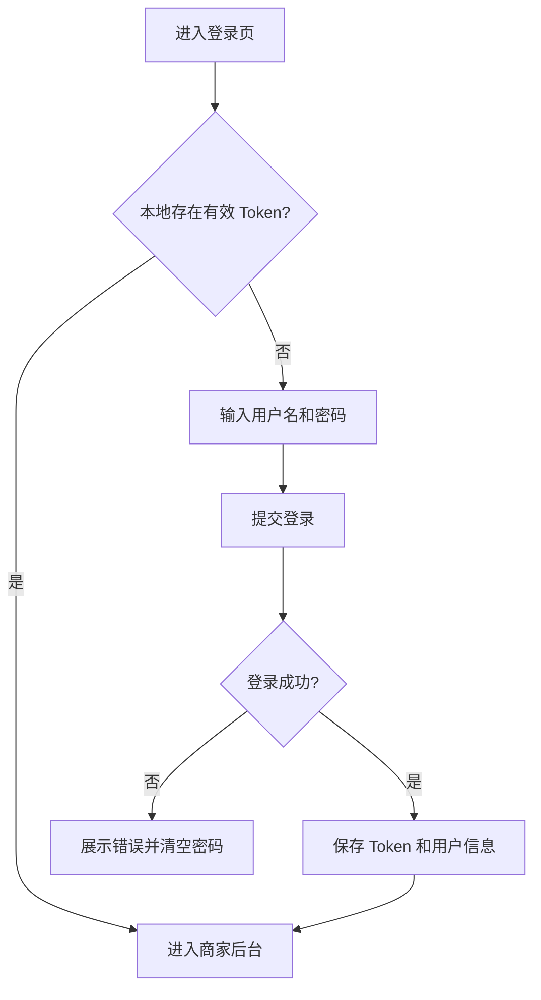
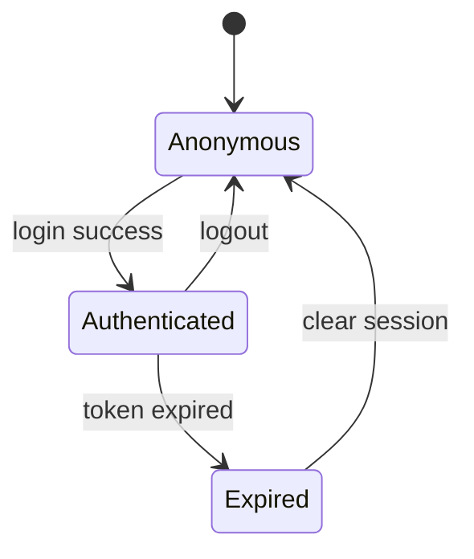

# 用户认证-登录注册

## 1. 模块概述

### 1.1 功能特性

用户认证模块服务于商家端，提供注册、登录、个人信息查询、资料修改、修改密码和退出登录能力。认证方式为 JWT Token，后端登录失败 5 次会锁定账号 30 分钟，密码使用 BCrypt 加密存储。

### 1.2 业务价值

- 保证商家后台关键操作只对已认证用户开放。
- 为优惠券模板管理和推送任务管理提供用户上下文和店铺编号。
- 降低暴力破解风险，提升账号安全性。

### 1.3 用户场景与交互目标

| 场景 | 用户目标 | 前端目标 |
| --- | --- | --- |
| 新商家注册 | 创建后台账号 | 降低表单填写成本，明确校验反馈 |
| 商家登录 | 快速进入后台 | 减少输入错误，保留重定向路径 |
| 修改资料 | 更新手机号/邮箱 | 支持局部编辑和保存反馈 |
| 修改密码 | 提升账号安全 | 成功后清除登录态并引导重新登录 |

## 2. 京东页面参考

### 2.1 参考模块

- 京东登录页：居中表单、红色主按钮、账号密码错误的即时提示。
- 京东账户安全页：安全操作以列表项呈现，重要操作二次确认。

### 2.2 异同点

| 项目 | 京东参考 | OneCoupon 实现 |
| --- | --- | --- |
| 主色 | 京东红强调转化 | 用户端用红色，商家端降低饱和度 |
| 登录布局 | 品牌左侧/表单右侧常见布局 | 后台系统可用居中窄表单，提升效率 |
| 安全操作 | 修改密码、绑定手机 | 保留修改密码、手机号、邮箱 |

## 3. 界面设计

### 3.1 页面布局

```text
┌────────────────────────────────────────────┐
│ OneCoupon 商家后台                          │
├────────────────────────────────────────────┤
│                                            │
│          ┌──────────────────────┐          │
│          │ 用户名               │          │
│          │ 密码                 │          │
│          │ [ ] 记住登录状态      │          │
│          │ [ 登录 ]             │          │
│          │ 还没有账号？注册      │          │
│          └──────────────────────┘          │
│                                            │
└────────────────────────────────────────────┘
```

示意图资源：`assets/auth-flow.mmd`。

### 3.2 关键 UI 元素规格

| 元素 | 规格 | 状态 |
| --- | --- | --- |
| 用户名输入框 | 3-32 位，字母/数字/下划线 | 默认、聚焦、错误、禁用 |
| 密码输入框 | 6-32 位，支持显隐切换 | 默认、聚焦、错误、Loading |
| 登录按钮 | 主按钮，宽度 100% | 默认、悬停、禁用、Loading |
| 注册表单 | 用户名、密码、确认密码、手机号、邮箱 | 字段级错误提示 |
| 修改密码弹窗 | 原密码、新密码、确认密码 | 成功后自动退出 |

### 3.3 交互流程



## 4. 技术实现

### 4.1 技术栈选型

| 技术 | 用途 | 选型依据 |
| --- | --- | --- |
| Vue 3 + TypeScript | 页面和组件 | 类型约束表单字段 |
| Pinia | 登录状态 | 跨页面共享用户信息 |
| Axios | API 请求 | 拦截器统一注入 Token |
| Element Plus Form | 表单校验 | 后台表单成熟稳定 |

### 4.2 组件层次

```text
src/views/auth/
├── LoginPage.vue
├── RegisterPage.vue
├── ProfilePage.vue
└── components/
    ├── PasswordField.vue
    └── ChangePasswordDialog.vue
```

### 4.3 数据处理逻辑

```ts
interface AuthState {
  token: string
  userId: string
  username: string
  shopNumber: string | null
  expireTime: number
}
```

1. 登录成功后保存 `token`、`expireTime` 和用户信息。
2. Axios 请求拦截器添加 `Authorization: Bearer ${token}`。
3. 响应拦截器遇到 `401` 或 `A000001` 登录过期文案时清除登录态。
4. 修改密码成功后清除本地状态并跳转登录页。

## 5. API 接口

统一响应格式：

```json
{
  "code": "0",
  "message": null,
  "data": {},
  "requestId": ""
}
```

### 5.1 用户注册

| 项 | 值 |
| --- | --- |
| URL | `/api/merchant-admin/user/register` |
| Method | `POST` |
| 权限 | 匿名 |

| 参数 | 类型 | 必填 | 约束 |
| --- | --- | --- | --- |
| username | string | 是 | 3-32 位，`^[a-zA-Z0-9_]+$` |
| password | string | 是 | 6-32 位 |
| phone | string | 否 | `^1[3-9]\d{9}$` |
| mail | string | 否 | 邮箱格式 |

### 5.2 用户登录

| 项 | 值 |
| --- | --- |
| URL | `/api/merchant-admin/user/login` |
| Method | `POST` |
| 权限 | 匿名 |

| 响应字段 | 类型 | 说明 |
| --- | --- | --- |
| token | string | JWT Token |
| expireTime | number/string | 过期毫秒时间戳，大整数按字符串安全处理 |
| userId | string | 用户 ID |
| username | string | 用户名 |
| shopNumber | number/string/null | 店铺编号 |

### 5.3 用户信息与安全接口

| 功能 | Method | URL | 请求 |
| --- | --- | --- | --- |
| 获取用户信息 | GET | `/api/merchant-admin/user/info` | 无 |
| 修改用户信息 | POST | `/api/merchant-admin/user/update` | `{ phone?, mail? }` |
| 修改密码 | POST | `/api/merchant-admin/user/change-password` | `{ oldPassword, newPassword }` |
| 退出登录 | POST | `/api/merchant-admin/user/logout` | 无 |

### 5.4 错误码

| code | 场景 | 前端处理 |
| --- | --- | --- |
| `A000001` | 参数错误、用户名已存在、密码错误、未登录 | 表单或 Toast 提示 |
| `B000001` | 服务异常 | Toast 提示并保留页面状态 |

## 6. 状态管理

### 6.1 状态模型

| 状态 | 字段 | 持久化 |
| --- | --- | --- |
| 未登录 | `token=''` | 不持久化 |
| 已登录 | `token, userId, username, expireTime` | `localStorage` 或 `sessionStorage` |
| 登录过期 | `expireTime < Date.now()` | 自动清除 |

### 6.2 状态流转



## 7. 权限控制

| 路由 | 权限 | 异常处理 |
| --- | --- | --- |
| `/login` | 匿名 | 已登录重定向后台首页 |
| `/register` | 匿名 | 已登录重定向后台首页 |
| `/merchant/**` | 已登录商家 | 未登录跳转 `/login?redirect=...` |

角色矩阵：

| 功能 | 匿名 | 商家 |
| --- | --- | --- |
| 登录/注册 | 允许 | 重定向 |
| 个人信息 | 禁止 | 允许 |
| 修改密码 | 禁止 | 允许 |

## 8. 错误处理

| 异常 | 展示方式 | 用户引导 |
| --- | --- | --- |
| 表单校验失败 | 字段下方红字 | 定位首个错误字段 |
| 账号锁定 | 顶部 Alert + 倒计时 | 提示稍后重试 |
| Token 过期 | Toast | 自动跳转登录 |
| 网络超时 | Toast + 重试按钮 | 保留输入内容 |

## 9. 性能优化

- 登录页 JS 首屏体积控制在 120KB gzip 内。
- 登录后并行拉取用户信息和后台菜单配置。
- 表单校验使用本地正则，避免每次输入触发接口请求。

## 10. 浏览器兼容性

| 浏览器 | 版本 |
| --- | --- |
| Chrome | 100+ |
| Edge | 100+ |
| Firefox | 100+ |
| Safari | 15+ |

兼容策略：避免依赖第三方 Cookie；本地存储异常时降级为内存 Token。

## 11. 测试策略

- 单元测试：用户名、密码、手机号、邮箱校验函数。
- 组件测试：登录 Loading、防重复提交、错误提示。
- E2E：登录成功、登录失败 5 次锁定、Token 过期跳转、修改密码后重新登录。
