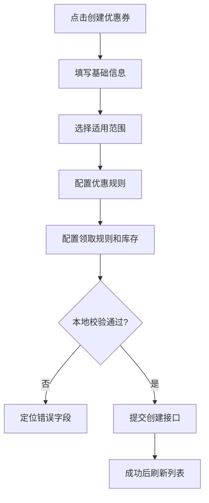
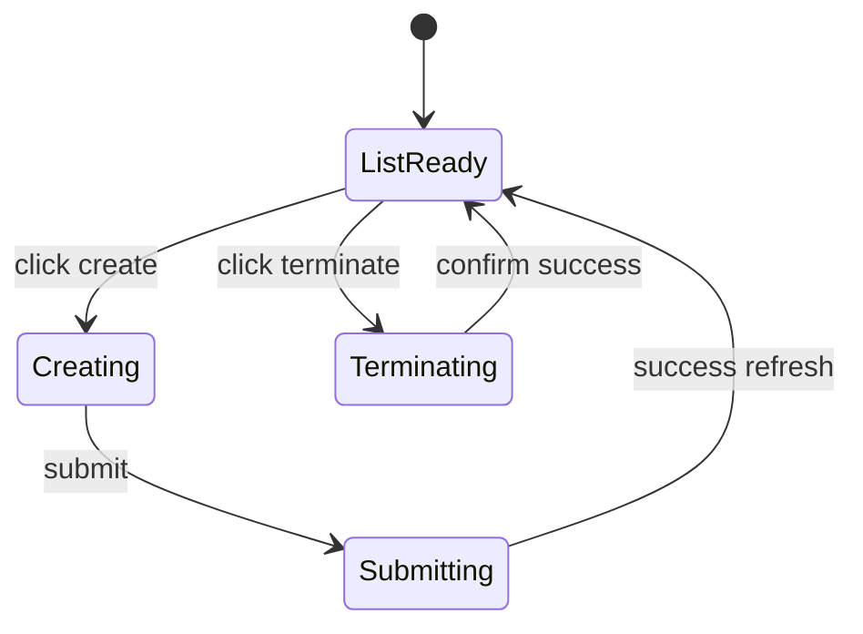

# 优惠券模板管理-模板维护

## 1. 模块概述

### 1.1 功能特性

优惠券模板管理模块面向商家端，提供优惠券模板创建、分页查询、详情查看、结束模板和追加发行量功能。模板是后续领券中心展示、批量推送、结算用券的基础数据。

### 1.2 业务价值

- 将优惠券营销规则结构化，支撑后续发券和核销链路。
- 支持商家按店铺维度管理券库存、有效期、领取限制和使用门槛。
- 为 C 端页面提供稳定的券展示字段和可用性判断依据。

### 1.3 用户场景

| 场景 | 用户目标 | 页面目标 |
| --- | --- | --- |
| 创建活动券 | 快速配置满减、立减、折扣券 | 分步骤降低规则配置复杂度 |
| 查询模板 | 找到指定活动券 | 支持筛选、分页、状态标签 |
| 结束模板 | 停止继续发放 | 二次确认并刷新状态 |
| 追加发行量 | 增加库存 | 明确当前库存和追加数量 |

## 2. 京东页面参考

### 2.1 参考模块

- 京东领券卡片：面额强突出、门槛说明紧跟面额、有效期弱化展示。
- 京东商家后台列表：筛选区 + 表格 + 行操作按钮的管理型布局。

### 2.2 设计取舍

用户端展示沿用京东式券卡片视觉；商家端配置页不做营销化视觉，采用表单、表格和步骤条，提升录入准确性。

## 3. 界面设计

### 3.1 页面结构

```text
┌────────────────────────────────────────────────────────┐
│ 优惠券模板管理                         [创建优惠券]     │
├────────────────────────────────────────────────────────┤
│ 筛选：券名称 [____] 类型 [全部] 状态 [全部] [查询] [重置] │
├────────────────────────────────────────────────────────┤
│ 表格：名称 | 类型 | 门槛 | 库存 | 有效期 | 状态 | 操作     │
│ 操作：详情 / 追加发行量 / 结束                           │
└────────────────────────────────────────────────────────┘
```

示意图资源：`assets/coupon-template-layout.mmd`。

### 3.2 创建表单

| 分组 | 字段 | UI 控件 | 说明 |
| --- | --- | --- | --- |
| 基础信息 | name | 输入框 | 优惠券名称，建议 4-30 字 |
| 基础信息 | source | 单选 | 0 店铺券，1 平台券 |
| 适用范围 | target | 单选 | 0 商品专属，1 全店通用 |
| 适用范围 | goods | 商品编码输入框 | `target=0` 时必填 |
| 优惠规则 | type | 分段控件 | 0 立减，1 满减，2 折扣 |
| 优惠规则 | consumeRule | 动态表单 | 门槛、最大优惠、折扣率、说明 |
| 领取规则 | receiveRule | 动态表单 | 每人限领、使用说明 |
| 发行设置 | stock | 数字输入 | 正整数 |
| 有效期 | validStartTime/validEndTime | 日期时间范围 | 结束时间必须晚于开始时间 |

### 3.3 交互流程



### 3.4 关键 UI 状态

| 元素 | 默认 | 禁用 | 危险操作 |
| --- | --- | --- | --- |
| 创建按钮 | 商家已登录可用 | 未登录不可见 | 无 |
| 结束按钮 | 生效中展示 | 已结束/已删除禁用 | 红色文字按钮 + 二次确认 |
| 追加发行量 | 生效中展示 | 非生效禁用 | 输入正整数 |

## 4. 技术实现

### 4.1 组件结构

```text
src/views/merchant/coupon-template/
├── CouponTemplateList.vue
├── CouponTemplateCreate.vue
├── CouponTemplateDetailDrawer.vue
└── components/
    ├── CouponRuleForm.vue
    ├── ReceiveRuleForm.vue
    └── CouponPreviewCard.vue
```

### 4.2 数据结构

```ts
interface CouponTemplateSavePayload {
  name: string
  source: 0 | 1
  target: 0 | 1
  goods?: string
  type: 0 | 1 | 2
  validStartTime: string
  validEndTime: string
  stock: number
  receiveRule: string
  consumeRule: string
}
```

### 4.3 规则序列化

```ts
function buildConsumeRule(form: RuleForm): string {
  return JSON.stringify({
    termsOfUse: form.termsOfUse,
    maximumDiscountAmount: form.maximumDiscountAmount,
    discountRate: form.type === 2 ? form.discountRate : undefined,
    explanationOfUnmetConditions: form.explanationOfUnmetConditions,
    validityPeriod: form.validityPeriod
  })
}
```

## 5. API 接口

### 5.1 创建优惠券模板

| 项 | 值 |
| --- | --- |
| URL | `/api/merchant-admin/coupon-template/save` |
| Method | `POST` |
| 权限 | 商家登录 |

| 参数 | 类型 | 必填 | 约束 |
| --- | --- | --- | --- |
| name | string | 是 | 非空 |
| source | number | 是 | 0 店铺券，1 平台券 |
| target | number | 是 | 0 商品专属，1 全店通用 |
| goods | string | 否 | 商品专属时必填 |
| type | number | 是 | 0 立减，1 满减，2 折扣 |
| validStartTime | string | 是 | `yyyy-MM-dd HH:mm:ss` |
| validEndTime | string | 是 | 晚于开始时间 |
| stock | number | 是 | 正整数 |
| receiveRule | string | 是 | JSON 字符串 |
| consumeRule | string | 是 | JSON 字符串 |

### 5.2 查询接口

| 功能 | Method | URL | 参数 |
| --- | --- | --- | --- |
| 分页查询 | GET | `/api/merchant-admin/coupon-template/page` | page/current/size、name、type、status 等以 DTO 为准 |
| 详情查询 | GET | `/api/merchant-admin/coupon-template/find` | `couponTemplateId` |
| 结束模板 | POST | `/api/merchant-admin/coupon-template/terminate` | `couponTemplateId` |
| 追加发行量 | POST | `/api/merchant-admin/coupon-template/increase-number` | `{ couponTemplateId, number }` |

### 5.3 响应格式

```json
{
  "code": "0",
  "message": null,
  "data": {
    "records": [],
    "total": "120",
    "current": 1,
    "size": 10
  }
}
```

## 6. 状态管理

| 状态 | 字段 |
| --- | --- |
| 查询条件 | `filters` |
| 分页 | `pagination.current`、`pagination.size`、`pagination.total` |
| 列表 | `templates` |
| 创建草稿 | `draft` |
| 当前详情 | `selectedTemplate` |

状态流转：



持久化策略：筛选条件和分页可写入 URL Query；创建草稿可选用 `sessionStorage` 防止刷新丢失。

## 7. 权限控制

| 角色 | 创建 | 查询 | 结束 | 追加发行量 |
| --- | --- | --- | --- | --- |
| 匿名 | 禁止 | 禁止 | 禁止 | 禁止 |
| 商家 | 允许 | 允许 | 允许 | 允许 |

前端只做入口控制，最终权限以后端 JWT 和店铺上下文为准。

## 8. 错误处理

| 场景 | 提示 | 处理 |
| --- | --- | --- |
| 有效期非法 | “结束时间必须晚于开始时间” | 阻止提交 |
| 商品专属未填商品 | “请输入商品编码” | 定位字段 |
| 重复提交 | 后端返回幂等错误 | Toast 提示 |
| 结束失败 | “优惠券结束失败，请稍后重试” | 保持原状态并刷新列表 |

## 9. 性能优化

- 列表分页请求防抖 300ms。
- 详情抽屉懒加载，避免列表一次性加载全部规则 JSON。
- JSON 规则解析做容错，失败时展示原始规则和错误标记。

## 10. 浏览器兼容性

支持 Chrome/Edge/Firefox 100+、Safari 15+。日期时间统一使用字符串，不依赖浏览器原生 `Date` 解析非标准格式。

## 11. 测试策略

- 单元测试：规则序列化、日期范围校验、金额格式化。
- 组件测试：创建表单动态字段、结束确认弹窗、追加库存弹窗。
- E2E：创建模板、分页查询、查看详情、追加发行量、结束模板。
