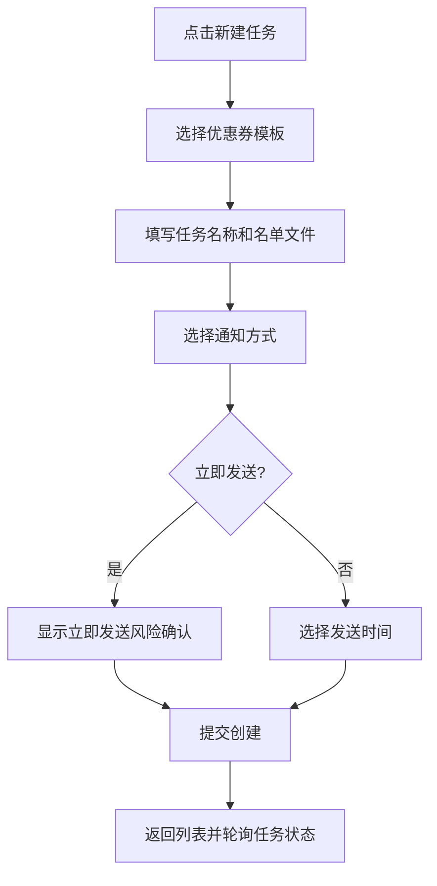
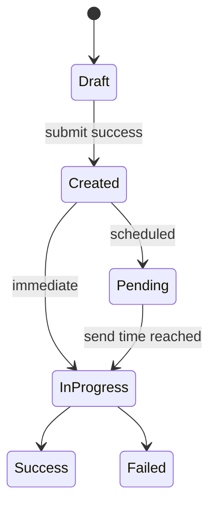

# 推送任务管理-批量发券

## 1. 模块概述

### 1.1 功能特性

推送任务管理模块面向商家端，支持基于 Excel 用户名单创建优惠券批量推送任务，选择通知方式、发送时间和优惠券模板，并查询任务执行状态和任务详情。

### 1.2 业务价值

- 支撑大批量精准营销，将优惠券按批次发放给目标用户。
- 通过任务化管理降低大文件处理和发券链路对前台交互的影响。
- 为运营人员提供执行进度和结果追踪入口。

### 1.3 用户场景

| 场景 | 用户目标 | 页面目标 |
| --- | --- | --- |
| 立即发券 | 选模板、上传名单、马上发送 | 快速完成配置并确认风险 |
| 定时发券 | 指定未来时间发送 | 提供时间校验和任务预览 |
| 查询任务 | 查看执行状态 | 状态标签、筛选和详情入口 |

## 2. 京东页面参考

参考京东商家后台常见任务创建模式：顶部步骤条、配置表单、右侧摘要预览、提交前二次确认。与京东 C 端不同，本模块不强调营销视觉，重点是可控、可追踪和错误可恢复。

## 3. 界面设计

### 3.1 页面布局

```text
┌────────────────────────────────────────────────────┐
│ 推送任务管理                         [新建任务]     │
├────────────────────────────────────────────────────┤
│ 筛选：批次ID [__] 任务名 [__] 状态 [__] [查询]       │
├────────────────────────────────────────────────────┤
│ 任务表格：批次ID | 名称 | 模板 | 发送数 | 状态 | 操作 │
└────────────────────────────────────────────────────┘
```

示意图资源：`assets/coupon-task-flow.mmd`。

### 3.2 新建任务表单

| 字段 | 控件 | 约束 |
| --- | --- | --- |
| taskName | 输入框 | 必填，建议 4-40 字 |
| couponTemplateId | 模板选择器 | 必填，从模板列表选择 |
| fileAddress | 文件地址输入/文件选择 | 必填，后端当前接收文件路径 |
| notifyType | 多选框 | 0 站内信，1 弹框，2 邮箱，3 短信 |
| sendType | 单选 | 0 立即发送，1 定时发送 |
| sendTime | 日期时间选择器 | 定时发送时必填且晚于当前时间 |

### 3.3 交互流程



## 4. 技术实现

### 4.1 组件结构

```text
src/views/merchant/coupon-task/
├── CouponTaskList.vue
├── CouponTaskCreate.vue
├── CouponTaskDetailDrawer.vue
└── components/
    ├── CouponTemplateSelector.vue
    ├── NotifyTypeCheckboxGroup.vue
    └── TaskStatusTag.vue
```

### 4.2 数据处理逻辑

```ts
interface CouponTaskCreatePayload {
  taskName: string
  fileAddress: string
  notifyType: string
  couponTemplateId: string
  sendType: 0 | 1
  sendTime?: string
}
```

`notifyType` 在 UI 中使用数组维护，提交前转换为后端需要的逗号字符串：

```ts
const payload = {
  ...form,
  notifyType: form.notifyTypes.join(',')
}
```

## 5. API 接口

### 5.1 创建推送任务

| 项 | 值 |
| --- | --- |
| URL | `/api/merchant-admin/coupon-task/create` |
| Method | `POST` |
| 权限 | 商家登录 |

| 参数 | 类型 | 必填 | 约束 |
| --- | --- | --- | --- |
| taskName | string | 是 | 非空 |
| fileAddress | string | 是 | Excel 文件路径 |
| notifyType | string | 是 | 逗号分隔，如 `0,3` |
| couponTemplateId | string | 是 | 优惠券模板 ID |
| sendType | number | 是 | 0 立即，1 定时 |
| sendTime | string | 条件必填 | `sendType=1` 时必填 |

### 5.2 查询任务

| 功能 | Method | URL | 参数 |
| --- | --- | --- | --- |
| 分页查询 | GET | `/api/merchant-admin/coupon-task/page` | `batchId`、`taskName`、`couponTemplateId`、`status`、分页 |
| 详情查询 | GET | `/api/merchant-admin/coupon-task/find` | `taskId` |

### 5.3 状态枚举

| 值 | 含义 | UI |
| --- | --- | --- |
| 0 | 待执行 | 灰色 |
| 1 | 执行中 | 蓝色 + 进度提示 |
| 2 | 执行失败 | 红色 |
| 3 | 执行成功 | 绿色 |
| 4 | 取消 | 灰色 |

## 6. 状态管理

| 状态 | 说明 |
| --- | --- |
| `taskList` | 当前分页任务 |
| `filters` | 查询条件 |
| `creating` | 创建提交中 |
| `pollingTaskIds` | 需要轮询的执行中任务 |

状态流转：



## 7. 权限控制

匿名用户禁止访问；商家只能查看自己的店铺任务。前端从 Token 获取登录态，不允许手动输入 `operatorId` 或 `shopNumber`。

角色矩阵：

| 功能 | 匿名 | 商家 |
| --- | --- | --- |
| 创建任务 | 禁止 | 允许 |
| 查询任务 | 禁止 | 允许 |
| 查看详情 | 禁止 | 允许 |

## 8. 错误处理

| 场景 | 提示 | 处理 |
| --- | --- | --- |
| 文件地址为空 | “请选择或填写名单文件” | 阻止提交 |
| 定时发送未选时间 | “请选择发送时间” | 阻止提交 |
| 模板不存在 | “优惠券模板不存在，请重新选择” | 清空模板选择 |
| 重复提交 | “请勿短时间内重复提交优惠券推送任务” | Toast |

## 9. 性能优化

- 任务列表轮询只针对执行中任务，间隔建议 5-10 秒。
- 任务详情抽屉按需请求，避免列表加载时拉取大字段。
- 表格列固定操作区，提升高数据量浏览效率。

## 10. 浏览器兼容性

文件路径输入不依赖浏览器上传能力；若后续改为直传，应支持 Chrome/Edge/Firefox 100+，并为 Safari 做上传进度降级。

## 11. 测试策略

- 单元测试：通知方式数组与字符串转换、定时发送校验。
- 组件测试：创建任务表单、状态标签、轮询停止。
- E2E：创建立即任务、创建定时任务、查询任务详情、失败状态展示。
