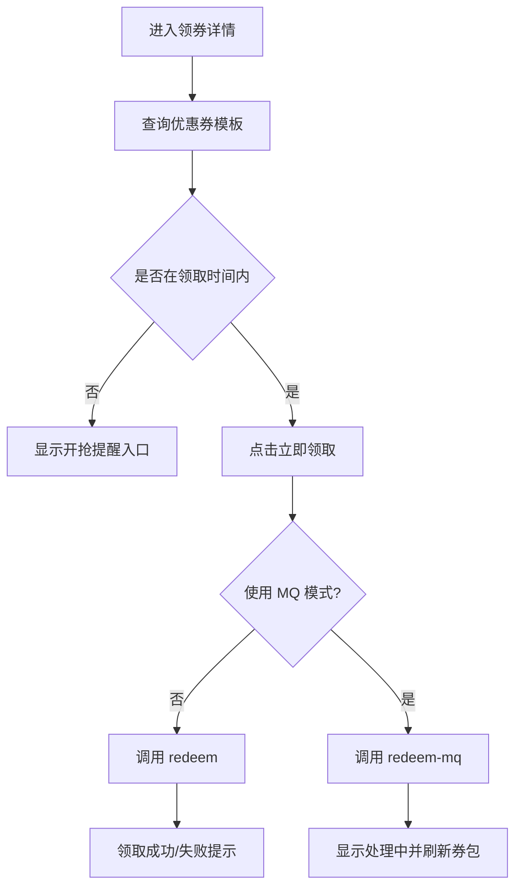
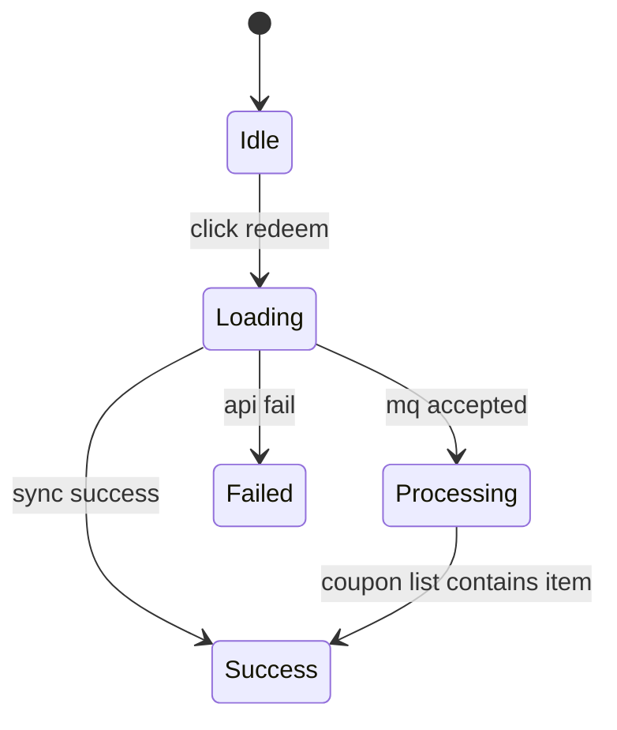

# 领券中心-优惠券领取

## 1. 模块概述

### 1.1 功能特性

领券中心面向 C 端用户，展示可领取优惠券详情，并支持普通领取和高并发场景下的 MQ 异步领取。当前后端提供单券模板查询和领券接口，前端可先实现基于模板 ID/店铺 ID 的券详情页，也可扩展为聚合列表。

### 1.2 业务价值

- 提升优惠券曝光和领取转化。
- 通过明确库存、门槛、有效期和限领规则降低用户误解。
- 为秒杀式抢券场景提供异步领取交互。

### 1.3 用户场景

| 场景 | 用户目标 | 前端目标 |
| --- | --- | --- |
| 浏览券详情 | 判断是否值得领取 | 面额、门槛、有效期一眼可见 |
| 立即领取 | 快速入券包 | 按钮状态清晰，成功后状态更新 |
| 抢券高峰 | 排队/异步领取 | 给出“处理中”反馈，避免重复点击 |

## 2. 京东页面参考

### 2.1 参考模块

- 京东领券中心：红色券面、左侧金额/折扣突出，右侧领取按钮。
- 京东商品详情优惠弹层：可领取券按门槛排序，已领取态按钮弱化。

### 2.2 设计差异

| 项 | 京东 | OneCoupon |
| --- | --- | --- |
| 券列表 | 大量运营券聚合 | 当前以后端单券查询为基础，可扩展列表 |
| 领取反馈 | 按钮变“已领取” | 同步成功直接变更；MQ 模式显示“领取处理中” |
| 库存 | 通常弱展示 | 本项目库存是核心并发指标，可显示“剩余紧张” |

## 3. 界面设计

### 3.1 券卡片布局

```text
┌──────────────────────────────────────────────┐
│ ￥30 / 8折             [立即领取]             │
│ 满 100 可用  | 店铺券 | 全店通用               │
│ 有效期：2026-05-01 00:00 至 2026-05-31 23:59 │
│ 每人限领 1 张 | 使用说明：不可叠加             │
└──────────────────────────────────────────────┘
```

示意图资源：`assets/coupon-center-card.mmd`。

### 3.2 UI 元素状态

| 元素 | 状态 | 说明 |
| --- | --- | --- |
| 领取按钮 | 可领取 | 红色主按钮 |
| 领取按钮 | 领取中 | Loading，禁用重复点击 |
| 领取按钮 | 已领取 | 灰色弱按钮 |
| 领取按钮 | 已抢光 | 灰色禁用 |
| 提醒入口 | 未开始 | 显示“开抢提醒” |

### 3.3 交互流程



## 4. 技术实现

### 4.1 组件结构

```text
src/views/user/coupon-center/
├── CouponCenterPage.vue
├── CouponDetailPage.vue
└── components/
    ├── CouponCard.vue
    ├── CouponRulePanel.vue
    └── RedeemButton.vue
```

### 4.2 数据模型

```ts
interface CouponTemplate {
  id: string
  shopNumber: string
  name: string
  source: 0 | 1
  target: 0 | 1
  goods?: string
  type: 0 | 1 | 2
  validStartTime: string
  validEndTime: string
  stock: number
  receiveRule: string
  consumeRule: string
  status: number
}
```

### 4.3 展示算法

1. 解析 `consumeRule`，根据 `type` 展示立减、满减或折扣。
2. 解析 `receiveRule`，展示每人限领和使用说明。
3. 根据当前时间与有效期判断按钮是否可领。
4. 根据 `stock` 判断库存状态：`0` 已抢光，`1-20` 库存紧张，其他正常。

## 5. API 接口

### 5.1 查询优惠券模板

| 项 | 值 |
| --- | --- |
| URL | `/api/engine/coupon-template/query` |
| Method | `GET` |
| 权限 | 用户登录态，具体以后端网关策略为准 |

| 参数 | 类型 | 必填 | 说明 |
| --- | --- | --- | --- |
| shopNumber | string | 是 | 店铺编号 |
| couponTemplateId | string | 是 | 优惠券模板 ID |

### 5.2 领取优惠券

| 功能 | Method | URL | 请求体 |
| --- | --- | --- | --- |
| 同步领取 | POST | `/api/engine/user-coupon/redeem` | `{ source, shopNumber, couponTemplateId }` |
| MQ 异步领取 | POST | `/api/engine/user-coupon/redeem-mq` | `{ source, shopNumber, couponTemplateId }` |

| 请求字段 | 类型 | 约束 |
| --- | --- | --- |
| source | number | 0 领券中心，1 平台发放，2 店铺领取 |
| shopNumber | string | 必填 |
| couponTemplateId | string | 必填 |

### 5.3 失败响应

| 场景 | message | 前端处理 |
| --- | --- | --- |
| 不在领取时间 | 不满足优惠券领取时间 | 显示预约提醒入口 |
| 库存不足 | 优惠券已被领取完啦 | 按钮置为已抢光 |
| 达到限领 | 用户重复领取优惠券/限领错误 | 按钮置为已领取或提示 |

## 6. 状态管理

| 状态 | 字段 |
| --- | --- |
| 券详情 | `currentTemplate` |
| 领取状态 | `redeemStatus: idle/loading/success/processing/failed` |
| 规则解析结果 | `displayRule` |
| 本地已领缓存 | `redeemedTemplateIds` |

状态流转：



持久化：`redeemedTemplateIds` 可短期写入 `sessionStorage`，最终以“我的优惠券”接口结果为准。

## 7. 权限控制

| 功能 | 匿名 | 登录用户 |
| --- | --- | --- |
| 浏览券详情 | 可选允许 | 允许 |
| 立即领取 | 禁止 | 允许 |
| 预约提醒 | 禁止 | 允许 |

匿名点击领取时跳转登录，并保留当前券详情 URL。

## 8. 错误处理

| 分类 | 场景 | 提示 |
| --- | --- | --- |
| 业务错误 | 已抢光 | “券已抢光，下次早点来” |
| 业务错误 | 未开始 | “活动尚未开始，可设置提醒” |
| 业务错误 | 已达限领 | “你已领取过该优惠券” |
| 网络错误 | 请求超时 | “领取请求超时，请稍后查看券包” |

## 9. 性能优化

- 券卡片组件纯展示化，解析规则结果缓存。
- 领取按钮加 800ms 前端防抖。
- MQ 模式下不高频轮询，建议用户进入“我的优惠券”确认。

## 10. 浏览器兼容性

移动端 WebView 需兼容 iOS Safari 15+、Android Chrome 100+。按钮 Loading 不依赖 CSS 高级滤镜。

## 11. 测试策略

- 单元测试：规则解析、库存状态、按钮状态计算。
- 组件测试：可领/已领/已抢光/未开始四种卡片态。
- E2E：查询券详情、同步领取成功、异步领取处理中、未登录跳转。
