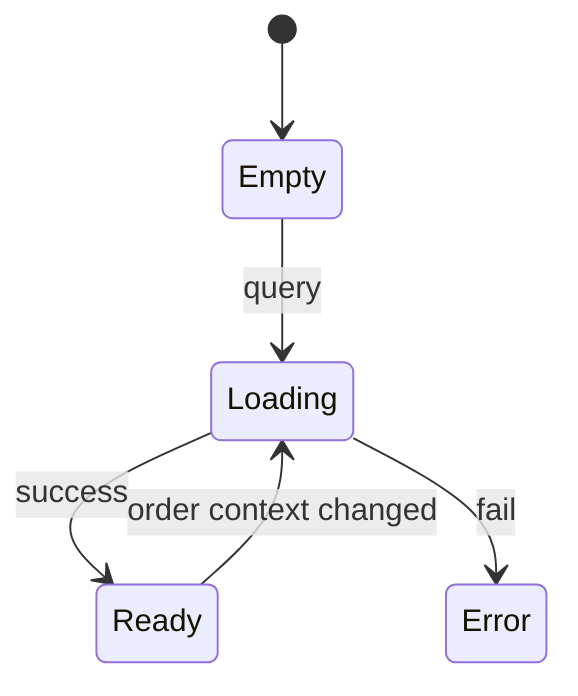

# 我的优惠券-券包管理

## 1. 模块概述

### 1.1 功能特性

我的优惠券模块面向 C 端用户，展示用户已领取的优惠券，并按照可用、不可用、已过期或已使用进行分组。当前后端主要通过结算查询接口返回可用/不可用优惠券列表，前端可基于订单上下文展示用券能力，也可扩展为个人券包页。

### 1.2 业务价值

- 帮助用户理解自己拥有的优惠权益。
- 通过“去使用”引导用户进入购买和结算流程。
- 减少结算时因优惠券不可用带来的疑惑。

### 1.3 用户场景

| 场景 | 用户目标 | 前端目标 |
| --- | --- | --- |
| 查看券包 | 确认还有哪些券 | 标签分组清晰 |
| 查不可用原因 | 理解为什么不能用 | 明确门槛、商品、时间原因 |
| 去使用 | 跳转商品或结算 | CTA 明确 |

## 2. 京东页面参考

参考京东“我的优惠券”页面：顶部状态 Tab、红色可用券、灰色过期/已用券、不可用原因展示。OneCoupon 保留京东式券卡片，但金额、门槛、适用范围字段以后端 `consumeRule` 和 `goods` 为准。

## 3. 界面设计

### 3.1 页面布局

```text
┌────────────────────────────────────────────┐
│ 我的优惠券                                  │
│ [可用] [不可用] [已使用] [已过期]            │
├────────────────────────────────────────────┤
│ ￥30 满100可用                              │
│ 店铺券 / 全店通用 / 有效期至 2026-05-31      │
│ [去使用]                                    │
├────────────────────────────────────────────┤
│ 灰色券：满200可用                           │
│ 不可用原因：当前订单未达到使用门槛            │
└────────────────────────────────────────────┘
```

示意图资源：`assets/my-coupons-tabs.mmd`。

### 3.2 UI 状态

| 状态 | 视觉 | 操作 |
| --- | --- | --- |
| 可用 | 红色券面 | 去使用 |
| 不可用 | 灰色券面 | 查看原因 |
| 已使用 | 灰色 + 已使用章 | 无 |
| 已过期 | 灰色 + 已过期章 | 删除/隐藏可选 |

## 4. 技术实现

### 4.1 组件结构

```text
src/views/user/my-coupons/
├── MyCouponsPage.vue
└── components/
    ├── CouponTabs.vue
    ├── UserCouponCard.vue
    └── UnavailableReason.vue
```

### 4.2 数据模型

```ts
interface QueryCouponsResp {
  availableCoupons: QueryCouponDetail[]
  notAvailableCoupons: QueryCouponDetail[]
}

interface QueryCouponDetail {
  id: string
  couponTemplateId: string
  name: string
  type: 0 | 1 | 2
  goods?: string
  validEndTime: string
  couponAmount?: string
}
```

## 5. API 接口

### 5.1 查询订单场景可用/不可用优惠券

| 项 | 值 |
| --- | --- |
| URL | `/api/settlement/coupon-query` |
| Method | `POST` |
| 权限 | 登录用户 |

| 参数 | 类型 | 必填 | 说明 |
| --- | --- | --- | --- |
| orderAmount | number/string | 是 | 订单总金额 |
| goodsList | array | 是 | 商品列表 |

`goodsList`：

| 字段 | 类型 | 说明 |
| --- | --- | --- |
| goodsNumber | string | 商品编码 |
| goodsAmount | number/string | 商品金额 |

### 5.2 同步查询

| 项 | 值 |
| --- | --- |
| URL | `/api/settlement/coupon-query-sync` |
| Method | `POST` |
| 用途 | 调试或降级，返回结构同上 |

## 6. 状态管理

| 状态 | 字段 |
| --- | --- |
| 当前 Tab | `activeTab` |
| 可用券 | `availableCoupons` |
| 不可用券 | `notAvailableCoupons` |
| 查询上下文 | `orderAmount`、`goodsList` |
| 加载状态 | `loading` |

状态流转：



持久化策略：券包页不长期缓存金额计算结果；订单上下文变化必须重新查询。

## 7. 权限控制

| 功能 | 匿名 | 登录用户 |
| --- | --- | --- |
| 查看券包 | 禁止 | 允许 |
| 查看不可用原因 | 禁止 | 允许 |
| 去使用 | 禁止 | 允许 |

## 8. 错误处理

| 场景 | 提示 | 处理 |
| --- | --- | --- |
| 无优惠券 | “暂无优惠券” | 展示空状态和去领券入口 |
| 查询失败 | “优惠券加载失败” | 支持重试 |
| 规则解析失败 | “优惠券规则异常” | 卡片置灰 |

## 9. 性能优化

- 列表虚拟滚动阈值：超过 100 张券启用。
- 不可用原因懒渲染，点击展开再计算说明。
- 金额格式化统一用纯函数，避免每次渲染重复解析 JSON。

## 10. 浏览器兼容性

移动端支持 iOS Safari 15+ 和 Android Chrome 100+。Tab 吸顶使用 `position: sticky`，低版本降级为普通顶部区域。

## 11. 测试策略

- 单元测试：可用/不可用分组渲染、金额格式化。
- 组件测试：Tab 切换、空状态、错误重试。
- E2E：订单上下文查询优惠券、查看不可用原因、点击去使用。
