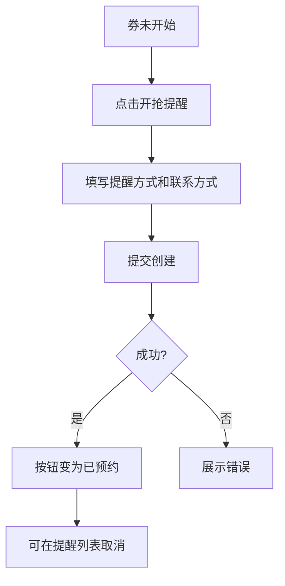
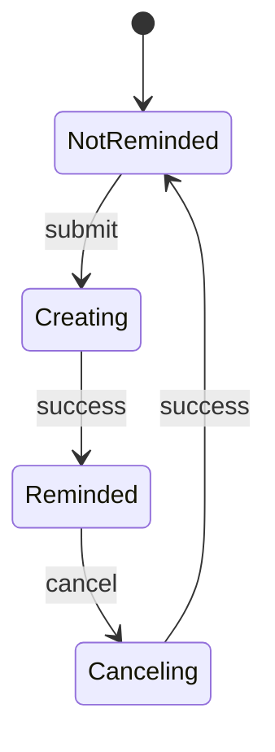

# 预约提醒-开抢提醒

## 1. 模块概述

### 1.1 功能特性

预约提醒模块面向 C 端用户，在优惠券尚未开始领取时，允许用户创建开抢提醒、查询提醒列表和取消提醒。提醒方式可覆盖站内消息、短信、邮箱等，由后端 `type` 字段承载。

### 1.2 业务价值

- 提升未开始活动的预约转化。
- 帮助用户在券开抢前及时返回，提升领券成功率。
- 为运营活动沉淀用户意向。

### 1.3 用户场景

| 场景 | 用户目标 | 前端目标 |
| --- | --- | --- |
| 活动未开始 | 设置提醒 | 一键预约，补充联系方式 |
| 查看提醒 | 管理预约列表 | 按开抢时间排序 |
| 取消提醒 | 取消无效提醒 | 二次确认避免误操作 |

## 2. 京东页面参考

参考京东秒杀/预约抢购：倒计时、开抢提醒按钮、预约成功后按钮状态变更。OneCoupon 聚焦优惠券开抢，不展示商品抢购库存，只展示券有效期、提醒时间和联系方式。

## 3. 界面设计

### 3.1 提醒入口

```text
┌─────────────────────────────────────┐
│ 优惠券活动将在 05月01日 10:00 开始   │
│ 距开始 02:15:30                      │
│ [开抢提醒]                           │
└─────────────────────────────────────┘
```

示意图资源：`assets/remind-flow.mmd`。

### 3.2 创建提醒弹窗

| 字段 | 控件 | 说明 |
| --- | --- | --- |
| remindTime | 单选 | 提前 5/10/15/30 分钟 |
| type | 单选/多选 | 提醒方式 |
| contact | 输入框 | 邮箱或手机号 |
| startTime | 只读 | 开抢时间 |

### 3.3 交互流程



## 4. 技术实现

### 4.1 组件结构

```text
src/views/user/coupon-remind/
├── CouponRemindList.vue
└── components/
    ├── RemindButton.vue
    ├── RemindDialog.vue
    └── CountdownText.vue
```

### 4.2 倒计时逻辑

```ts
function getCountdown(startTime: string) {
  const diff = new Date(startTime).getTime() - Date.now()
  return {
    expired: diff <= 0,
    hours: Math.floor(diff / 3600000),
    minutes: Math.floor((diff % 3600000) / 60000),
    seconds: Math.floor((diff % 60000) / 1000)
  }
}
```

## 5. API 接口

### 5.1 创建提醒

| 项 | 值 |
| --- | --- |
| URL | `/api/engine/coupon-template-remind/create` |
| Method | `POST` |

| 参数 | 类型 | 必填 | 说明 |
| --- | --- | --- | --- |
| couponTemplateId | string | 是 | 优惠券模板 ID |
| name | string | 否 | 优惠券名称 |
| shopNumber | string | 是 | 店铺编号 |
| userId | string | 是 | 用户 ID |
| contact | string | 否 | 联系方式 |
| type | number | 是 | 提醒方式 |
| remindTime | number | 是 | 提前分钟数 |
| startTime | string | 是 | 开抢时间 |

### 5.2 查询与取消

| 功能 | Method | URL | 请求 |
| --- | --- | --- | --- |
| 查询提醒 | GET | `/api/engine/coupon-template-remind/list` | `couponTemplateId?`、`userId?` |
| 取消提醒 | POST | `/api/engine/coupon-template-remind/cancel` | 以 `CouponTemplateRemindCancelReqDTO` 为准 |

## 6. 状态管理

| 状态 | 字段 |
| --- | --- |
| 当前券预约状态 | `remindedTemplateIds` |
| 提醒列表 | `remindList` |
| 倒计时 | `countdownMap` |
| 提交状态 | `submitting` |

状态流转：



## 7. 权限控制

| 功能 | 匿名 | 登录用户 |
| --- | --- | --- |
| 查看倒计时 | 允许 | 允许 |
| 创建提醒 | 禁止 | 允许 |
| 查询提醒 | 禁止 | 允许 |
| 取消提醒 | 禁止 | 允许 |

匿名点击提醒时跳转登录，登录后回到原券详情。

## 8. 错误处理

| 场景 | 提示 | 处理 |
| --- | --- | --- |
| 已预约 | “你已设置提醒” | 按钮变已预约 |
| 联系方式格式错 | “请输入正确手机号或邮箱” | 阻止提交 |
| 活动已开始 | “活动已开始，请直接领取” | 关闭弹窗 |
| 取消失败 | “取消失败，请稍后重试” | 保持已预约状态 |

## 9. 性能优化

- 多个倒计时共用一个 `setInterval`，页面销毁时清理。
- 提醒列表按时间分页或虚拟列表展示。
- 查询提醒结果短期缓存 1 分钟，减少重复进入券详情的请求。

## 10. 浏览器兼容性

倒计时使用时间戳差值，避免依赖浏览器对非 ISO 日期字符串的解析。移动端输入联系方式时使用合适 `inputmode`。

## 11. 测试策略

- 单元测试：倒计时计算、联系方式校验。
- 组件测试：提醒按钮状态、弹窗提交、取消确认。
- E2E：未登录提醒跳转、创建提醒、查询列表、取消提醒。
