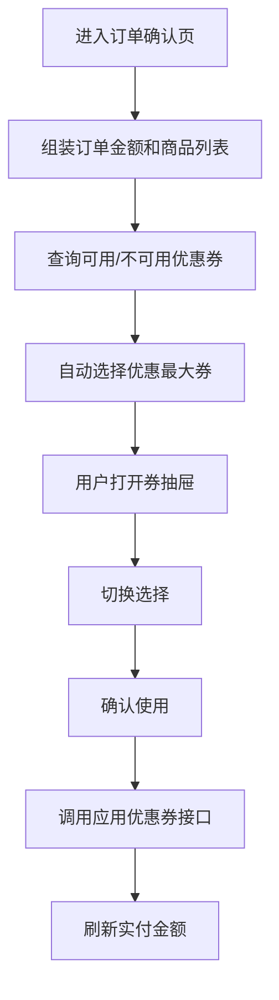
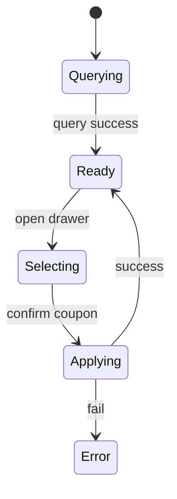

# 优惠券结算-订单用券

## 1. 模块概述

### 1.1 功能特性

优惠券结算模块用于订单确认页，根据订单金额和商品列表查询用户可用/不可用优惠券，允许用户选择一张优惠券应用到订单金额，并在下单链路中创建优惠券结算记录、支付后核销、退款后退回。

### 1.2 业务价值

- 在结算关键节点提升优惠感知和订单转化。
- 明确展示最佳可用优惠券，降低用户决策成本。
- 通过不可用原因减少用户对优惠规则的困惑。

### 1.3 用户场景

| 场景 | 用户目标 | 页面目标 |
| --- | --- | --- |
| 确认订单 | 自动选择最优券 | 展示抵扣金额和最终金额 |
| 手动换券 | 比较不同券优惠 | 抽屉/弹层列出可用和不可用券 |
| 支付成功 | 核销优惠券 | 不让用户重复使用同一张券 |
| 退款 | 退回优惠券 | 状态回滚并提示用户 |

## 2. 京东页面参考

### 2.1 参考模块

- 京东订单确认页：优惠券行展示“已优惠金额”，点击进入券选择弹层。
- 京东券选择弹层：可用券靠前，不可用券折叠或置灰，并展示不可用原因。

### 2.2 设计考量

OneCoupon 不照搬京东复杂促销叠加体系，当前设计以“单张优惠券选择”为核心，保留最优券推荐、不可用原因和确认使用机制。

## 3. 界面设计

### 3.1 订单确认页优惠区

```text
┌────────────────────────────────────────────┐
│ 商品金额                           ￥199.00 │
│ 优惠券                      -￥30.00   >    │
│ 实付金额                           ￥169.00 │
└────────────────────────────────────────────┘
```

示意图资源：`assets/settlement-coupon-drawer.mmd`。

### 3.2 优惠券选择抽屉

| 区域 | 内容 |
| --- | --- |
| 顶部 | 可用券数量、当前已选券 |
| 可用券列表 | 金额、门槛、有效期、单选按钮 |
| 不可用券列表 | 置灰券卡片、不可用原因 |
| 底部 | 不使用优惠券、确认使用 |

### 3.3 交互流程



## 4. 技术实现

### 4.1 组件结构

```text
src/views/order/settlement/
├── OrderConfirmPage.vue
└── components/
    ├── CouponSummaryRow.vue
    ├── CouponSelectDrawer.vue
    ├── SettlementCouponCard.vue
    └── PriceSummary.vue
```

### 4.2 金额计算原则

- 前端只做展示级计算，最终金额以后端返回为准。
- 所有金额使用字符串或 `Decimal` 类处理，避免浮点误差。
- 自动选择策略：按 `couponAmount` 从大到小排序，选择第一张可用券。

```ts
function chooseBestCoupon(coupons: CouponDetail[]) {
  return [...coupons].sort((a, b) => decimal(b.couponAmount).minus(a.couponAmount).toNumber())[0]
}
```

## 5. API 接口

### 5.1 查询可用/不可用优惠券

| 项 | 值 |
| --- | --- |
| URL | `/api/settlement/coupon-query` |
| Method | `POST` |
| 权限 | 登录用户 |

| 参数 | 类型 | 必填 | 说明 |
| --- | --- | --- | --- |
| orderAmount | number/string | 是 | 订单金额 |
| goodsList | array | 是 | 商品明细 |

### 5.2 应用优惠券

| 项 | 值 |
| --- | --- |
| URL | `/api/settlement/apply-coupon/{couponId}` |
| Method | `POST` |
| 权限 | 登录用户 |
| 当前状态 | 后端实现返回 `null`，前端需做好空响应保护 |

请求体以 `ApplyCouponReqDTO` 为准，建议字段：

| 参数 | 类型 | 说明 |
| --- | --- | --- |
| orderAmount | number/string | 订单金额 |
| goodsList | array | 商品列表 |
| userId | string | 用户 ID，如后端上下文可省略 |

### 5.3 引擎结算链路接口

| 功能 | Method | URL |
| --- | --- | --- |
| 创建结算单 | POST | `/api/engine/user-coupon/create-payment-record` |
| 支付后核销 | POST | `/api/engine/user-coupon/process-payment` |
| 退款退回 | POST | `/api/engine/user-coupon/process-refund` |

## 6. 状态管理

| 状态 | 字段 |
| --- | --- |
| 订单上下文 | `orderAmount`、`goodsList` |
| 可用券 | `availableCoupons` |
| 不可用券 | `notAvailableCoupons` |
| 当前选择 | `selectedCouponId` |
| 价格摘要 | `discountAmount`、`payAmount` |

状态流转：



持久化：订单页刷新后必须重新查询；不持久化结算结果，避免价格过期。

## 7. 权限控制

| 功能 | 匿名 | 登录用户 |
| --- | --- | --- |
| 查询结算券 | 禁止 | 允许 |
| 应用优惠券 | 禁止 | 允许 |
| 创建结算单 | 禁止 | 允许或订单系统调用 |

## 8. 错误处理

| 场景 | 提示 | 处理 |
| --- | --- | --- |
| 查询失败 | “优惠券信息加载失败” | 支持重试，不阻塞无券下单 |
| 应用失败 | “优惠券使用失败，请重新选择” | 清除选中券并刷新 |
| 后端空响应 | “当前优惠券暂不可用” | 防止页面金额变成 NaN |
| 金额变化 | “订单金额已变化，已重新计算优惠” | 重新查询 |

## 9. 性能优化

- 订单商品列表变化后防抖 300ms 查询。
- 券抽屉首次打开再渲染不可用券列表。
- 金额计算使用 memo，避免每次输入地址/备注触发券卡片重算。

## 10. 浏览器兼容性

移动端抽屉高度使用 `max-height: 80vh`，兼容 Safari 地址栏高度变化。金额字段不使用 `Intl.NumberFormat` 的冷门选项，保证老版本浏览器显示稳定。

## 11. 测试策略

- 单元测试：最优券选择、金额格式化、空响应保护。
- 组件测试：抽屉选择、不使用优惠券、不可用原因展示。
- E2E：进入结算页自动选券、手动换券、接口失败降级、订单金额变化重新查询。
