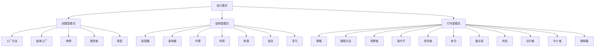

# 邮惠券营销分发系统设计模式技术文档

> **文档版本**：v1.0  
> **最后更新**：2026-03-23  
> **适用项目**：mall-cqupt-lqy11 邮惠券营销分发系统  
> **技术栈**：Java 17 + Spring Boot 3.0.7 + Spring Cloud 2022.0.3

---

## 目录

- [1. 概述](#1-概述)
  - [1.1 文档目的](#11-文档目的)
  - [1.2 项目背景](#12-项目背景)
  - [1.3 适用范围](#13-适用范围)
- [2. 设计模式理论基础](#2-设计模式理论基础)
  - [2.1 设计模式的概念](#21-设计模式的概念)
  - [2.2 设计模式的分类](#22-设计模式的分类)
  - [2.3 设计模式的核心原则](#23-设计模式的核心原则)
- [3. 创建型设计模式应用](#3-创建型设计模式应用)
  - [3.1 工厂模式（Factory Pattern）](#31-工厂模式 factory-pattern)
  - [3.2 单例模式（Singleton Pattern）](#32-单例模式 singleton-pattern)
  - [3.3 建造者模式（Builder Pattern）](#33-建造者模式 builder-pattern)
- [4. 结构型设计模式应用](#4-结构型设计模式应用)
  - [4.1 代理模式（Proxy Pattern）](#41-代理模式 proxy-pattern)
  - [4.2 适配器模式（Adapter Pattern）](#42-适配器模式 adapter-pattern)
- [5. 行为型设计模式应用](#5-行为型设计模式应用)
  - [5.1 策略模式（Strategy Pattern）](#51-策略模式 strategy-pattern)
  - [5.2 模板方法模式（Template Method Pattern）](#52-模板方法模式 template-method-pattern)
  - [5.3 观察者模式（Observer Pattern）](#53-观察者模式 observer-pattern)
  - [5.4 责任链模式（Chain of Responsibility Pattern）](#54-责任链模式 chain-of-responsibility-pattern)
- [6. 设计模式扩展实践](#6-设计模式扩展实践)
  - [6.1 组合模式的应用场景](#61-组合模式的应用场景)
  - [6.2 状态模式的潜在应用](#62-状态模式的潜在应用)
  - [6.3 访问者模式的适用场景](#63-访问者模式的适用场景)
- [7. 总结与最佳实践](#7-总结与最佳实践)
  - [7.1 设计模式应用总结](#71-设计模式应用总结)
  - [7.2 最佳实践建议](#72-最佳实践建议)
  - [7.3 常见误区与避免方法](#73-常见误区与避免方法)
- [附录](#附录)
  - [A. 设计模式速查表](#a-设计模式速查表)
  - [B. 推荐阅读资源](#b-推荐阅读资源)

---

## 1. 概述

### 1.1 文档目的

本文档旨在系统性地分析和总结**邮惠券营销分发系统**中设计模式的应用实践，为开发团队提供以下价值：

- **技术沉淀**：记录项目中优秀的设计模式应用案例
- **知识传承**：帮助新成员快速理解系统架构设计思想
- **开发指导**：为后续功能扩展提供设计模式选择参考
- **代码优化**：识别可改进的代码结构，提升系统可维护性

### 1.2 项目背景

**邮惠券营销分发系统**是一个基于微服务架构的电商平台优惠券管理系统，主要功能包括：

- **优惠券管理**：创建、编辑、删除优惠券模板
- **批量分发**：支持 Excel 批量导入用户，按批次分发优惠券
- **用户领取**：用户领取优惠券，支持高并发秒杀场景
- **结算核销**：订单结算时计算优惠金额，核销优惠券
- **搜索查询**：基于 Elasticsearch 的优惠券搜索功能
- **提醒服务**：抢券提醒、到期提醒等营销触达

系统采用 Spring Cloud 微服务架构，包含 7 个核心服务模块：

```
mall-cqupt-lqy11/
├── distribution/      # 分发服务
├── engine/           # 引擎服务（核心业务）
├── settlement/       # 结算服务
├── search/           # 搜索服务
├── merchant-admin/   # 商家后台服务
├── gateway/          # 网关服务
└── framework/        # 基础架构组件
```

### 1.3 适用范围

本文档适用于以下角色：

| 角色 | 使用场景 | 重点关注章节 |
|------|---------|-------------|
| **后端开发工程师** | 日常开发、代码重构 | 第 3-5 章（具体模式应用） |
| **系统架构师** | 架构设计、技术选型 | 第 2 章（理论基础）、第 7 章（最佳实践） |
| **技术经理** | 代码评审、团队培训 | 全文，特别是第 7 章 |
| **新入职员工** | 快速上手、学习规范 | 第 2 章（理论基础）、附录 A |

---

## 2. 设计模式理论基础

### 2.1 设计模式的概念

**设计模式（Design Pattern）** 是指在软件设计中反复出现的、经过验证的、可复用的解决方案模板。它不是具体的代码实现，而是对一类问题的抽象解决方法论。

#### 2.1.1 设计模式的四大要素

1. **模式名称（Pattern Name）**
   - 助记符，用于描述设计问题、解决方案和效果
   - 例：策略模式、工厂模式、观察者模式

2. **问题（Problem）**
   - 描述何时适用该模式
   - 说明问题产生的背景和约束条件

3. **解决方案（Solution）**
   - 描述设计的组成成分（类、对象等）
   - 说明各成分的职责、协作关系
   - 提供代码实现示例

4. **效果（Consequences）**
   - 模式应用的优点和缺点
   - 对系统可维护性、可扩展性、性能的影响

#### 2.1.2 为什么使用设计模式？

设计模式的核心价值体现在以下几个方面：

- ✅ **提高代码复用性**：避免重复造轮子，使用经过验证的解决方案
- ✅ **增强可维护性**：代码结构清晰，便于理解和修改
- ✅ **提升可扩展性**：遵循开闭原则，易于添加新功能
- ✅ **促进团队沟通**：统一的设计术语，降低沟通成本
- ✅ **降低耦合度**：模块间依赖减少，系统更健壮

### 2.2 设计模式的分类

根据**设计模式的目的**，可将其分为三大类：



#### 2.2.1 创建型模式（Creational Patterns）

**核心思想**：将对象的创建和使用分离，使系统不依赖于对象创建、表示和实现的具体细节。

| 模式名称 | 意图 | 适用场景 |
|---------|------|---------|
| **工厂方法** | 定义创建对象的接口，让子类决定实例化哪个类 | 系统需要灵活扩展新产品类型 |
| **抽象工厂** | 创建相关或依赖对象的家族，无需指定具体类 | 需要创建一系列相关的产品对象 |
| **单例** | 保证一个类仅有一个实例，并提供全局访问点 | 全局配置、资源管理器、缓存对象 |
| **建造者** | 分步骤构建复杂对象，隔离构建与表示 | 对象属性众多，构建过程复杂 |
| **原型** | 通过复制现有对象创建新对象 | 创建对象成本高，需要克隆复制 |

#### 2.2.2 结构型模式（Structural Patterns）

**核心思想**：处理类或对象的组合，将类或对象按更大结构组合，同时保持结构灵活高效。

| 模式名称 | 意图 | 适用场景 |
|---------|------|---------|
| **适配器** | 将一个类的接口转换成客户期望的另一个接口 | 复用现有类，但接口不兼容 |
| **装饰器** | 动态给对象添加职责，比继承更灵活 | 需要动态添加功能，避免类爆炸 |
| **代理** | 为其他对象提供代理以控制访问 | 延迟加载、访问控制、日志记录 |
| **外观** | 为子系统提供统一的高层接口 | 简化复杂子系统的使用 |
| **桥接** | 将抽象与实现分离，使二者可独立变化 | 抽象和实现都需要独立扩展 |
| **组合** | 将对象组合成树形结构表示"部分 - 整体"层次 | 树形结构、菜单、文件系统 |
| **享元** | 运用共享技术有效支持大量细粒度对象 | 大量相似对象，内存占用高 |

#### 2.2.3 行为型模式（Behavioral Patterns）

**核心思想**：关注对象间的通信和责任分配，描述算法和对象间职责的流动。

| 模式名称 | 意图 | 适用场景 |
|---------|------|---------|
| **策略** | 定义一系列算法，封装每个算法，使它们可互换 | 多种算法可替换，避免大量 if-else |
| **模板方法** | 定义算法骨架，将某些步骤延迟到子类 | 算法流程固定，部分步骤可变 |
| **观察者** | 定义对象间一对多依赖，状态改变时通知所有依赖者 | 事件驱动、消息通知、发布订阅 |
| **责任链** | 使多个对象都有机会处理请求，沿链传递 | 多级审批、过滤器链、拦截器链 |
| **命令** | 将请求封装为对象，支持参数化、队列化 | 命令撤销、事务日志、宏命令 |
| **状态** | 允许对象在内部状态改变时改变行为 | 状态驱动行为，状态转换复杂 |
| **访问者** | 表示作用于对象结构各元素的操作 | 对复杂对象结构执行操作 |
| **备忘录** | 在不破坏封装性的前提下捕获对象内部状态 | 撤销/恢复、快照、存档读档 |
| **中介者** | 用中介对象封装一系列对象交互 | 多对多交互复杂，网状依赖 |
| **迭代子** | 顺序访问聚合对象元素，无需暴露内部表示 | 遍历集合，统一遍历接口 |
| **解释器** | 给定语言，定义其文法表示和解释器 | 脚本引擎、规则引擎、SQL 解析 |

### 2.3 设计模式的核心原则

设计模式的实现遵循 **SOLID 原则**，这是面向对象设计的五大基本原则：

#### 2.3.1 单一职责原则（Single Responsibility Principle, SRP）

> **定义**：一个类应该只有一个引起它变化的原因。

**含义**：
- 一个类只负责一项职责
- 职责变化不会相互影响
- 降低类的复杂度，提高可读性

**项目中的应用**：
```java
// ✅ 正确示例：每个策略类只负责一种优惠券计算
public class DiscountCalculationStrategy implements CouponCalculationStrategy {
    @Override
    public BigDecimal calculateDiscount(CouponTemplateDO template, BigDecimal orderAmount) {
        // 只负责折扣券的计算逻辑
        DiscountCouponDO discountCoupon = (DiscountCouponDO) template;
        return orderAmount.multiply(BigDecimal.valueOf(discountCoupon.getDiscountRate()));
    }
}

// ❌ 错误示例：一个类处理所有优惠券类型
public class CouponCalculator {
    public BigDecimal calculate(CouponTemplateDO template, BigDecimal orderAmount, String type) {
        if ("DISCOUNT".equals(type)) {
            // 折扣券计算逻辑
        } else if ("THRESHOLD".equals(type)) {
            // 满减券计算逻辑
        } else if ("FIXED".equals(type)) {
            // 立减券计算逻辑
        }
        // 违反单一职责原则
    }
}
```

#### 2.3.2 开闭原则（Open-Closed Principle, OCP）

> **定义**：软件实体（类、模块、函数）应该对扩展开放，对修改关闭。

**含义**：
- 新增功能时，通过扩展已有代码实现
- 避免修改已有代码，降低回归风险
- 提高系统稳定性和可维护性

**项目中的应用**：
- 策略模式：新增优惠券类型只需添加新策略类
- 工厂模式：新增产品类型只需扩展工厂方法
- 模板方法：新增流程变体只需继承抽象类

#### 2.3.3 里氏替换原则（Liskov Substitution Principle, LSP）

> **定义**：子类对象必须能够替换掉所有父类对象。

**含义**：
- 子类可以扩展父类功能
- 子类不能改变父类原有行为
- 父类出现的地方可以用子类替换

**项目中的应用**：
```java
// 所有优惠券策略都实现同一接口
public interface CouponCalculationStrategy {
    BigDecimal calculateDiscount(CouponTemplateDO template, BigDecimal orderAmount);
}

// 使用时可以任意替换
CouponCalculationStrategy strategy1 = new DiscountCalculationStrategy();
CouponCalculationStrategy strategy2 = new ThresholdCalculationStrategy();
CouponCalculationStrategy strategy3 = new FixedDiscountCalculationStrategy();

// 调用方无需关心具体类型
BigDecimal discount = strategy.calculateDiscount(coupon, orderAmount);
```

#### 2.3.4 接口隔离原则（Interface Segregation Principle, ISP）

> **定义**：客户端不应该依赖它不需要的接口。

**含义**：
- 接口要小而专，不要大而全
- 一个接口只服务一个子模块或业务逻辑
- 避免胖接口，使用多个专门的接口

**项目中的应用**：
```java
// ✅ 正确示例：专门的策略接口
public interface CouponCalculationStrategy {
    BigDecimal calculateDiscount(CouponTemplateDO template, BigDecimal orderAmount);
}

// ❌ 错误示例：臃肿的接口
public interface CouponService {
    void createCoupon();
    BigDecimal calculateDiscount();
    void sendNotification();
    void exportExcel();
    // 接口职责不单一
}
```

#### 2.3.5 依赖倒置原则（Dependency Inversion Principle, DIP）

> **定义**：
> 1. 高层模块不应该依赖低层模块，二者都应该依赖其抽象
> 2. 抽象不应该依赖细节，细节应该依赖抽象

**含义**：
- 面向接口编程，而非面向实现编程
- 降低模块间耦合度
- 提高系统灵活性和可扩展性

**项目中的应用**：
```java
// ✅ 正确示例：依赖抽象接口
@Service
@RequiredArgsConstructor
public class CouponCalculationService {
    // 依赖抽象的策略接口，而非具体实现
    private final CouponCalculationStrategy strategy;
    
    public BigDecimal calculateDiscount(CouponTemplateDO coupon, BigDecimal orderAmount) {
        return strategy.calculateDiscount(coupon, orderAmount);
    }
}

// ❌ 错误示例：依赖具体实现
@Service
public class CouponCalculationService {
    // 直接依赖具体策略类
    private final DiscountCalculationStrategy strategy;
    // 无法灵活替换策略
}
```

---

## 3. 创建型设计模式应用

### 3.1 工厂模式（Factory Pattern）

#### 3.1.1 模式讲解

**工厂模式**是一种创建型设计模式，它提供了一种创建对象的最佳方式，将对象的创建和使用分离，使代码更加清晰、灵活和可维护。

**核心思想**：
- 定义一个用于创建对象的接口
- 让实现类决定实例化哪一个类
- 将对象的创建逻辑集中管理

**工厂模式的三种形式**：

| 类型 | 特点 | 适用场景 |
|------|------|---------|
| **简单工厂** | 一个工厂类创建所有对象 | 产品类型少，创建逻辑简单 |
| **工厂方法** | 每个产品对应一个工厂类 | 产品类型多，需要灵活扩展 |
| **抽象工厂** | 创建产品族的工厂接口 | 需要创建相关或依赖的产品族 |

**简单工厂模式结构图**：

```
┌─────────────────┐
│   Product     │  ← 抽象产品接口
└────────┬────────┘
         │
    ┌────┴────┐
    │         │
┌───▼───┐ ┌──▼────┐
│ProductA│ │ProductB│  ← 具体产品类
└───────┘ └───────┘
    ▲         ▲
    │         │
┌───┴─────────┴───┐
│   SimpleFactory  │  ← 简单工厂类
│  createProduct() │
└─────────────────┘
```

#### 3.1.2 项目中的应用实例

**应用场景**：优惠券类型对象创建

在邮惠券营销分发系统中，优惠券分为三种类型：
- **立减券**（FixedDiscountCouponDO）
- **满减券**（ThresholdCouponDO）
- **折扣券**（DiscountCouponDO）

**代码位置**：
- `settlement/src/main/java/com/cqupt/settlement/common/util/CouponFactory.java`
- `settlement/src/main/java/com/cqupt/settlement/dao/entity/DiscountCouponDO.java`
- `settlement/src/main/java/com/cqupt/settlement/dao/entity/ThresholdCouponDO.java`
- `settlement/src/main/java/com/cqupt/settlement/dao/entity/FixedDiscountCouponDO.java`

**核心代码实现**：

```java
/**
 * 优惠券工厂类 - 简单工厂模式实现
 * 根据优惠券类型创建对应的优惠券对象
 */
public class CouponFactory {
    
    /**
     * 创建优惠券对象
     * 
     * @param coupon 优惠券模板基础数据
     * @param additionalParams 附加参数（不同优惠券类型需要不同参数）
     * @return 具体类型的优惠券对象
     */
    public static CouponTemplateDO createCoupon(
            CouponTemplateDO coupon, 
            Map<String, Object> additionalParams) {
        
        // 参数验证
        if (coupon.getType() == null || 
            coupon.getType() >= DiscountTypeEnum.values().length || 
            coupon.getType() < 0) {
            throw new IllegalArgumentException("Invalid coupon type");
        }
        
        // 根据枚举类型创建不同优惠券对象
        switch (DiscountTypeEnum.values()[coupon.getType()]) {
            case FIXED_DISCOUNT:
                // 创建立减券
                Integer fixedDiscountAmount = (Integer) additionalParams.get("discountAmount");
                return new FixedDiscountCouponDO(coupon, fixedDiscountAmount);
                
            case THRESHOLD_DISCOUNT:
                // 创建满减券
                Integer thresholdAmount = (Integer) additionalParams.get("thresholdAmount");
                Integer thresholdDiscountAmount = (Integer) additionalParams.get("discountAmount");
                return new ThresholdCouponDO(coupon, thresholdAmount, thresholdDiscountAmount);
                
            case DISCOUNT_COUPON:
                // 创建折扣券
                Double discountRate = (Double) additionalParams.get("discountRate");
                return new DiscountCouponDO(coupon, discountRate);
                
            default:
                throw new IllegalArgumentException("Invalid coupon type");
        }
    }
}
```

**优惠券枚举定义**：

```java
/**
 * 优惠券类型枚举
 */
public enum DiscountTypeEnum {
    /**
     * 立减券 - 直接减免固定金额
     */
    FIXED_DISCOUNT(0, "立减券"),
    
    /**
     * 满减券 - 满足门槛后减免固定金额
     */
    THRESHOLD_DISCOUNT(1, "满减券"),
    
    /**
     * 折扣券 - 按比例折扣
     */
    DISCOUNT_COUPON(2, "折扣券");
    
    private final Integer code;
    private final String description;
    
    DiscountTypeEnum(Integer code, String description) {
        this.code = code;
        this.description = description;
    }
}
```

**具体产品类示例**：

```java
/**
 * 折扣券实体类
 * 继承自优惠券模板基类
 */
@Data
@NoArgsConstructor
@AllArgsConstructor
@Builder
public class DiscountCouponDO extends CouponTemplateDO {
    
    /**
     * 折扣率（0.8 表示 8 折）
     */
    private Double discountRate;
    
    /**
     * 构造方法：从基础模板构建折扣券
     */
    @Builder(builderMethodName = "discountCouponBuilder")
    public DiscountCouponDO(CouponTemplateDO coupon, Double discountRate) {
        super(coupon.getId(), coupon.getShopNumber(), coupon.getName(), 
              coupon.getSource(), coupon.getTarget(), coupon.getGoods(), 
              coupon.getType(), coupon.getValidStartTime(), coupon.getValidEndTime(), 
              coupon.getStock(), coupon.getReceiveRule(), coupon.getConsumeRule(), 
              coupon.getStatus(), coupon.getCreateTime(), coupon.getUpdateTime(), 
              coupon.getDelFlag());
        this.discountRate = discountRate;
    }
}
```

#### 3.1.3 应用效果分析

**解决的问题**：

1. **对象创建解耦**
   - 调用方无需知道具体优惠券类型的创建细节
   - 只需传入类型和参数，工厂返回对应对象

2. **集中管理创建逻辑**
   - 所有优惠券对象的创建逻辑集中在工厂类
   - 便于统一管理和维护

3. **符合开闭原则**
   - 新增优惠券类型只需扩展 switch 分支
   - 无需修改调用方代码

**架构优势**：

| 优势 | 说明 |
|------|------|
| **简化调用** | 调用方无需关心对象创建细节 |
| **易于扩展** | 新增优惠券类型只需修改工厂类 |
| **代码复用** | 创建逻辑集中，避免重复代码 |
| **类型安全** | 通过枚举类型检查，避免非法类型 |

**使用示例**：

```java
// 调用方代码简洁清晰
Map<String, Object> params = new HashMap<>();
params.put("discountRate", 0.8);

CouponTemplateDO coupon = CouponFactory.createCoupon(baseTemplate, params);

// 直接使用返回的优惠券对象
BigDecimal finalAmount = coupon.calculateDiscount(orderAmount);
```

#### 3.1.4 扩展实践建议

**工厂模式的适用场景**：

- ✅ 系统需要根据不同类型创建不同对象
- ✅ 对象创建逻辑复杂，需要集中管理
- ✅ 希望调用方无需关心对象创建细节
- ✅ 需要统一控制对象创建过程

**最佳实践**：

1. **配合策略模式使用**
   - 工厂负责创建对象
   - 策略负责对象行为
   - 二者结合，灵活性强

2. **使用枚举替代魔法值**
   - 避免使用 int、String 等魔法值
   - 使用枚举提高类型安全性

3. **考虑使用工厂方法模式**
   - 如果产品类型很多，简单工厂会过于臃肿
   - 可考虑使用工厂方法模式，每个产品对应一个工厂

**可能的改进方向**：

```java
// 改进：使用工厂方法模式
public interface CouponFactory {
    CouponTemplateDO createCoupon(Map<String, Object> params);
}

public class DiscountCouponFactory implements CouponFactory {
    @Override
    public CouponTemplateDO createCoupon(Map<String, Object> params) {
        Double discountRate = (Double) params.get("discountRate");
        return new DiscountCouponDO(baseTemplate, discountRate);
    }
}

// 工厂注册表
public class CouponFactoryRegistry {
    private static final Map<Integer, CouponFactory> factoryMap = new HashMap<>();
    
    static {
        factoryMap.put(DiscountTypeEnum.DISCOUNT_COUPON.getCode(), 
                      new DiscountCouponFactory());
        factoryMap.put(DiscountTypeEnum.THRESHOLD_DISCOUNT.getCode(), 
                      new ThresholdCouponFactory());
        factoryMap.put(DiscountTypeEnum.FIXED_DISCOUNT.getCode(), 
                      new FixedDiscountCouponFactory());
    }
    
    public static CouponFactory getFactory(Integer type) {
        return factoryMap.get(type);
    }
}
```

---

## 4. 结构型设计模式应用

### 4.1 代理模式（Proxy Pattern）

#### 4.1.1 模式讲解

**代理模式**是一种结构型设计模式，它为其他对象提供一种代理以控制对这个对象的访问。

**核心思想**：
- 在客户端和目标对象之间引入代理对象
- 由代理对象控制对目标对象的访问
- 可以在访问前后添加额外操作

**代理模式的类型**：

| 类型 | 特点 | 应用场景 |
|------|------|---------|
| **静态代理** | 代理类和目标类实现同一接口 | 接口固定，不需要动态生成 |
| **动态代理（JDK）** | 运行时动态生成代理类 | 基于接口代理，Spring AOP 默认 |
| **动态代理（CGLIB）** | 通过继承实现代理 | 可以代理类，无需接口 |
| **虚拟代理** | 延迟加载，节省资源 | 加载大图片、大数据 |
| **保护代理** | 控制访问权限 | 权限验证、访问控制 |
| **远程代理** | 为远程对象提供本地代表 | RPC、Web Service |
| **缓存代理** | 缓存结果，提高性能 | 数据库查询缓存 |

**静态代理示例**：
```java
// 抽象主题
public interface Subject {
    void request();
}

// 真实主题
public class RealSubject implements Subject {
    @Override
    public void request() {
        System.out.println("真实主题处理请求");
    }
}

// 代理主题
public class Proxy implements Subject {
    private RealSubject realSubject;
    
    @Override
    public void request() {
        // 前置处理
        System.out.println("代理：预处理");
        
        // 调用真实主题
        if (realSubject == null) {
            realSubject = new RealSubject();
        }
        realSubject.request();
        
        // 后置处理
        System.out.println("代理：后处理");
    }
}
```

#### 4.1.2 项目中的应用实例

**应用场景 1**：AOP 动态代理实现幂等性控制

**代码位置**：
- `framework/src/main/java/com/mall/cqupt/framework/idempotent/NoDuplicateSubmitAspect.java`
- `framework/src/main/java/com/mall/cqupt/framework/idempotent/NoMQDuplicateConsumeAspect.java`

**核心代码实现**：

```java
/**
 * 防止用户重复提交表单信息切面控制器
 * 使用 Spring AOP 动态代理实现
 */
@Aspect
@RequiredArgsConstructor
public final class NoDuplicateSubmitAspect {
    
    private final RedissonClient redissonClient;
    
    /**
     * 环绕通知：标记了 @NoDuplicateSubmit 注解的方法
     */
    @Around("@annotation(com.mall.cqupt.framework.idempotent.NoDuplicateSubmit)")
    public Object noRepeatSubmit(ProceedingJoinPoint joinPoint) throws Throwable {
        // 获取注解
        NoDuplicateSubmit noDuplicateSubmit = getNoRepeatSubmitAnnotation(joinPoint);
        
        // 构建分布式锁 Key
        String lockKey = String.format(
            "no-repeat-submit:path:%s:currentUserId:%s:md5:%s", 
            getServletPath(), 
            getCurrentUserId(), 
            calcArgsMD5(joinPoint)
        );
        
        // 获取分布式锁
        RLock lock = redissonClient.getLock(lockKey);
        
        // 尝试获取锁，失败意味着重复提交
        if (!lock.tryLock()) {
            throw new ClientException(noDuplicateSubmit.message());
        }
        
        Object result;
        try {
            // 调用目标方法（被代理对象）
            result = joinPoint.proceed();
        } finally {
            // 释放锁
            lock.unlock();
        }
        return result;
    }
    
    /**
     * 获取方法上的注解
     */
    public static NoDuplicateSubmit getNoRepeatSubmitAnnotation(
            ProceedingJoinPoint joinPoint) throws NoSuchMethodException {
        MethodSignature methodSignature = (MethodSignature) joinPoint.getSignature();
        Method targetMethod = joinPoint.getTarget().getClass()
            .getDeclaredMethod(methodSignature.getName(), 
                             methodSignature.getMethod().getParameterTypes());
        return targetMethod.getAnnotation(NoDuplicateSubmit.class);
    }
    
    /**
     * 计算参数 MD5 值
     */
    private String calcArgsMD5(ProceedingJoinPoint joinPoint) {
        return DigestUtil.md5Hex(JSON.toJSONBytes(joinPoint.getArgs()));
    }
}
```

**使用示例**：

```java
@RestController
@RequestMapping("/coupon")
@RequiredArgsConstructor
public class CouponController {
    
    private final CouponService couponService;
    
    /**
     * 领取优惠券
     * 使用 @NoDuplicateSubmit 防止重复提交
     */
    @PostMapping("/receive")
    @NoDuplicateSubmit(message = "请勿重复提交")
    public Result<Void> receiveCoupon(@RequestBody ReceiveCouponReqDTO request) {
        couponService.receiveCoupon(request);
        return Results.success();
    }
}
```

**应用场景 2**：Redis 缓存代理（缓存 + 数据库双重查询）

**代码位置**：
- `engine/src/main/java/com/mall/cqupt/engine/service/impl/CouponTemplateServiceImpl.java`

**核心代码实现**：

```java
@Service
@Slf4j
@RequiredArgsConstructor
public class CouponTemplateServiceImpl 
        extends ServiceImpl<CouponTemplateMapper, CouponTemplateDO> 
        implements CouponTemplateService {
    
    private final CouponTemplateMapper couponTemplateMapper;
    private final StringRedisTemplate stringRedisTemplate;
    private final RedissonClient redissonClient;
    private final RBloomFilter<String> couponTemplateQueryBloomFilter;
    private final TransactionTemplate transactionTemplate;
    
    @Override
    public CouponTemplateQueryRespDTO findCouponTemplate(
            CouponTemplateQueryReqDTO requestParam) {
        
        // 1. 先查询 Redis 缓存（代理层）
        String couponTemplateCacheKey = String.format(
            EngineRedisConstant.COUPON_TEMPLATE_KEY, 
            requestParam.getCouponTemplateId()
        );
        Map<Object, Object> couponTemplateCacheMap = stringRedisTemplate
            .opsForHash().entries(couponTemplateCacheKey);
        
        // 2. 缓存命中，直接返回
        if (MapUtil.isNotEmpty(couponTemplateCacheMap)) {
            return BeanUtil.mapToBean(
                couponTemplateCacheMap, 
                CouponTemplateQueryRespDTO.class, 
                false, 
                CopyOptions.create()
            );
        }
        
        // 3. 缓存未命中，通过布隆过滤器判断是否存在
        if (!couponTemplateQueryBloomFilter.contains(
                requestParam.getCouponTemplateId())) {
            throw new ClientException("优惠券模板不存在");
        }
        
        // 4. 检查空值缓存
        String couponTemplateIsNullCacheKey = String.format(
            EngineRedisConstant.COUPON_TEMPLATE_IS_NULL_KEY, 
            requestParam.getCouponTemplateId()
        );
        Boolean hasKeyFlag = stringRedisTemplate.hasKey(couponTemplateIsNullCacheKey);
        if (hasKeyFlag) {
            throw new ClientException("优惠券模板不存在");
        }
        
        // 5. 获取分布式锁，防止缓存击穿
        RLock lock = redissonClient.getLock(
            String.format(EngineRedisConstant.LOCK_COUPON_TEMPLATE_KEY, 
                         requestParam.getCouponTemplateId())
        );
        lock.lock();
        
        try {
            // 6. 双重检查
            hasKeyFlag = stringRedisTemplate.hasKey(couponTemplateIsNullCacheKey);
            if (hasKeyFlag) {
                throw new ClientException("优惠券模板不存在");
            }
            
            // 7. 查询数据库（真实主题）
            LambdaQueryWrapper<CouponTemplateDO> queryWrapper = Wrappers
                .lambdaQuery(CouponTemplateDO.class)
                .eq(CouponTemplateDO::getShopNumber, 
                    Long.parseLong(requestParam.getShopNumber()))
                .eq(CouponTemplateDO::getId, 
                    Long.parseLong(requestParam.getCouponTemplateId()));
            CouponTemplateDO couponTemplateDO = couponTemplateMapper.selectOne(queryWrapper);
            
            // 8. 数据库不存在，写入空值缓存
            if (couponTemplateDO == null) {
                stringRedisTemplate.opsForValue().set(
                    couponTemplateIsNullCacheKey, 
                    "", 
                    30, TimeUnit.MINUTES
                );
                throw new ClientException("优惠券模板不存在或已过期");
            }
            
            // 9. 写入 Redis 缓存
            CouponTemplateQueryRespDTO actualRespDTO = BeanUtil.toBean(
                couponTemplateDO, CouponTemplateQueryRespDTO.class
            );
            Map<String, Object> cacheTargetMap = BeanUtil.beanToMap(
                actualRespDTO, false, true
            );
            
            // 使用 Lua 脚本原子操作：设置 Hash + 过期时间
            String luaScript = "redis.call('HMSET', KEYS[1], unpack(ARGV, 1, #ARGV - 1)) " +
                             "redis.call('EXPIREAT', KEYS[1], ARGV[#ARGV])";
            
            List<String> keys = Collections.singletonList(couponTemplateCacheKey);
            List<String> args = new ArrayList<>(cacheTargetMap.size() * 2 + 1);
            
            cacheTargetMap.forEach((key, value) -> {
                args.add(key);
                args.add(value != null ? value.toString() : "");
            });
            args.add(String.valueOf(couponTemplateDO.getValidEndTime().getTime() / 1000));
            
            stringRedisTemplate.execute(
                new DefaultRedisScript<>(luaScript, Long.class),
                keys,
                args.toArray()
            );
            
            return actualRespDTO;
            
        } finally {
            lock.unlock();
        }
    }
}
```

#### 4.1.3 应用效果分析

**解决的问题**：

1. **横切关注点分离**
   - 将幂等性控制、日志记录等横切逻辑与业务逻辑分离
   - 业务代码更专注，只处理核心业务

2. **非侵入式增强**
   - 通过注解方式，无需修改业务代码即可添加功能
   - 符合开闭原则

3. **性能优化**
   - 缓存代理减少数据库访问
   - 提升系统响应速度
   - 防止缓存穿透、击穿、雪崩

4. **统一管控**
   - 集中管理分布式锁、幂等性校验等公共逻辑
   - 便于维护和升级

**架构优势**：

| 优势 | 说明 |
|------|------|
| **代码复用** | 横切逻辑只需编写一次，多处使用 |
| **易于维护** | 修改代理逻辑无需修改业务代码 |
| **性能提升** | 缓存代理减少数据库压力 |
| **安全性** | 分布式锁防止并发问题 |

**Spring AOP 工作原理**：

```
┌─────────────────┐
│   Client Code   │
└────────┬────────┘
         │ 调用
         ▼
┌─────────────────┐
│   Proxy Object  │  ← Spring 动态生成的代理对象
│  (CGLIB 或 JDK) │
├─────────────────┤
│ • 前置通知      │
│ • 环绕通知      │
│ • 后置通知      │
│ • 异常通知      │
└────────┬────────┘
         │ 调用
         ▼
┌─────────────────┐
│ Target Object   │  ← 真实业务对象
│  (被代理对象)   │
└─────────────────┘
```

#### 4.1.4 扩展实践建议

**代理模式的适用场景**：

- ✅ 需要在方法执行前后添加通用逻辑
- ✅ 需要控制对昂贵资源（数据库、外部 API）的访问
- ✅ 需要实现延迟加载、缓存优化
- ✅ 需要实现访问控制、权限验证

**最佳实践**：

1. **优先使用 Spring AOP**
   - 基于注解，使用简单
   - 与 Spring 生态集成好
   - 支持多种通知类型

2. **合理使用缓存代理**
   - 热点数据使用缓存
   - 注意缓存一致性
   - 设置合理的过期时间

3. **注意代理的性能开销**
   - 动态代理有轻微性能开销
   - 高频调用场景需评估影响
   - 避免过度使用 AOP

---

### 4.2 适配器模式（Adapter Pattern）

#### 4.2.1 模式讲解

**适配器模式**是一种结构型设计模式，它将一个类的接口转换成客户期望的另一个接口，使原本不兼容的类可以一起工作。

**核心思想**：
- 复用现有类，但接口不兼容
- 通过适配器转换接口
- 避免修改现有代码

**适配器模式的类型**：

| 类型 | 实现方式 | 优点 | 缺点 |
|------|---------|------|------|
| **类适配器** | 继承目标类和适配者类 | 简单直接 | 不支持多继承 |
| **对象适配器** | 组合适配者对象 | 更灵活，支持多适配 | 增加对象数量 |
| **接口适配器** | 实现接口所有方法 | 可选择性实现 | 接口方法多时繁琐 |

**对象适配器示例**：
```java
// 目标接口
public interface Target {
    void request();
}

// 适配者类
public class Adaptee {
    public void specificRequest() {
        System.out.println("适配者的特殊请求");
    }
}

// 适配器
public class Adapter implements Target {
    private Adaptee adaptee;
    
    public Adapter(Adaptee adaptee) {
        this.adaptee = adaptee;
    }
    
    @Override
    public void request() {
        adaptee.specificRequest();
    }
}
```

#### 4.2.2 项目中的应用实例

**应用场景**：EasyExcel 数据读取适配器

**代码位置**：
- `distribution/src/main/java/com/mall/cqupt/lqy/distribution/service/handler/excel/ReadExcelDistributionListener.java`
- `merchant-admin/src/main/java/com/mall/cqupt/merchant/admin/service/handler/excel/RowCountListener.java`

**核心代码实现**：

```java
/**
 * 优惠券任务读取 Excel 分发监听器
 * 适配 EasyExcel 的监听器接口
 */
@RequiredArgsConstructor
public class ReadExcelDistributionListener 
        extends AnalysisEventListener<CouponTaskExcelObject> {
    
    private final CouponTaskDO couponTask;
    private final CouponTemplateQueryRemoteRespDTO couponTemplate;
    private final StringRedisTemplate stringRedisTemplate;
    private final CouponTemplateExecuteProducer couponTemplateExecuteProducer;
    
    @Getter
    private int rowCount = 0; // 当前读取到了 Excel 的第几行
    
    private final static String STOCK_DECREMENT_AND_BATCH_SAVE_USER_RECORD_LUA_PATH = 
        "lua/stock_decrement_and_batch_save_user_record.lua";
    private final static int BATCH_USER_COUPON_SIZE = 5000;
    
    /**
     * 逐行处理 Excel 数据
     * 适配 EasyExcel 的 invoke 方法
     */
    @Override
    public void invoke(CouponTaskExcelObject data, AnalysisContext context) {
        ++rowCount;
        String couponTaskId = String.valueOf(couponTask.getId());
        
        // 1. 获取当前进度，判断是否已经执行过
        String templateTaskExecuteProgressKey = String.format(
            DistributionRedisConstant.TEMPLATE_TASK_EXECUTE_PROGRESS_KEY, 
            couponTaskId
        );
        String progress = stringRedisTemplate.opsForValue()
            .get(templateTaskExecuteProgressKey);
        
        // 如果进度存在，并且 Redis 记录的行数 > 当前行数，则跳过
        if (StrUtil.isNotBlank(progress) && Integer.parseInt(progress) > rowCount) {
            rowCount = Integer.parseInt(progress);
            return;
        }
        
        // 2. 获取 Lua 脚本（使用单例模式）
        DefaultRedisScript<Long> buildLuaScript = Singleton.get(
            STOCK_DECREMENT_AND_BATCH_SAVE_USER_RECORD_LUA_PATH, 
            () -> {
                DefaultRedisScript<Long> redisScript = new DefaultRedisScript<>();
                redisScript.setScriptSource(
                    new ResourceScriptSource(
                        new ClassPathResource(STOCK_DECREMENT_AND_BATCH_SAVE_USER_RECORD_LUA_PATH)
                    )
                );
                redisScript.setResultType(Long.class);
                return redisScript;
            }
        );
        
        // 3. 执行 Lua 脚本原子扣减库存
        String couponTemplateKey = String.format(
            EngineRedisConstant.COUPON_TEMPLATE_KEY, 
            couponTemplate.getId()
        );
        String batchUserSetKey = String.format(
            DistributionRedisConstant.TEMPLATE_TASK_EXECUTE_BATCH_USER_KEY, 
            couponTaskId
        );
        
        Long combinedField = stringRedisTemplate.execute(
            buildLuaScript, 
            ListUtil.of(couponTemplateKey, batchUserSetKey), 
            data.getUserId()
        );
        
        // 4. 解析 Lua 返回结果
        boolean firstField = StockDecrementReturnCombinedUtil
            .extractFirstField(combinedField);
        
        if (!firstField) {
            // 库存耗尽，同步进度
            stringRedisTemplate.opsForValue().set(
                templateTaskExecuteProgressKey, 
                String.valueOf(rowCount)
            );
            return;
        }
        
        // 5. 判断是否发送 MQ 消息
        long batchUserSetSize = StockDecrementReturnCombinedUtil
            .extractSecondField(combinedField);
        
        if (batchUserSetSize < BATCH_USER_COUPON_SIZE && 
            StrUtil.isBlank(couponTask.getNotifyType())) {
            stringRedisTemplate.opsForValue().set(
                templateTaskExecuteProgressKey, 
                String.valueOf(rowCount)
            );
            return;
        }
        
        // 6. 发送 MQ 消息削峰
        CouponTemplateExecuteEvent event = CouponTemplateExecuteEvent.builder()
            .userId(data.getUserId())
            .mail(data.getMail())
            .phone(data.getPhone())
            .couponTaskId(couponTaskId)
            .notifyType(couponTask.getNotifyType())
            .shopNumber(couponTask.getShopNumber())
            .couponTemplateId(couponTemplate.getId())
            .couponTemplateConsumeRule(couponTemplate.getConsumeRule())
            .batchUserSetSize(batchUserSetSize)
            .distributionEndFlag(Boolean.FALSE)
            .build();
        
        couponTemplateExecuteProducer.sendMessage(event);
        
        // 7. 同步进度
        stringRedisTemplate.opsForValue().set(
            templateTaskExecuteProgressKey, 
            String.valueOf(rowCount)
        );
    }
    
    /**
     * Excel 读取完成后的收尾工作
     * 适配 EasyExcel 的 doAfterAllAnalysed 方法
     */
    @Override
    public void doAfterAllAnalysed(AnalysisContext context) {
        // 发送 Excel 解析完成标识
        CouponTemplateExecuteEvent event = CouponTemplateExecuteEvent.builder()
            .batchUserSetSize(-1L)
            .distributionEndFlag(Boolean.TRUE)  // 设置解析完成标识
            .shopNumber(couponTask.getShopNumber())
            .couponTemplateId(couponTemplate.getId())
            .couponTemplateConsumeRule(couponTemplate.getConsumeRule())
            .couponTaskId(String.valueOf(couponTask.getId()))
            .build();
        
        couponTemplateExecuteProducer.sendMessage(event);
    }
}
```

#### 4.2.3 应用效果分析

**解决的问题**：

1. **接口兼容**
   - 将 EasyExcel 的监听器接口适配为业务需要的数据处理逻辑
   - 无需修改 EasyExcel 源码

2. **职责分离**
   - Excel 解析逻辑与业务处理逻辑解耦
   - 适配器只负责接口转换

3. **可扩展性**
   - 可轻松创建新的监听器处理不同类型的 Excel 数据
   - 遵循开闭原则

**架构优势**：

| 优势 | 说明 |
|------|------|
| **复用现有库** | 直接使用 EasyExcel，无需自己实现 |
| **接口转换** | 将第三方接口转换为业务友好接口 |
| **易于扩展** | 新增 Excel 类型只需新建监听器 |
| **代码清晰** | 业务逻辑与解析逻辑分离 |

#### 4.2.4 扩展实践建议

**适配器模式的适用场景**：

- ✅ 使用第三方库，但其接口与业务需求不匹配
- ✅ 需要复用现有类，但接口不一致
- ✅ 希望将复杂接口简化为业务友好接口

**最佳实践**：

1. **优先使用对象适配器**
   - 比类适配器更灵活
   - 支持多个适配者
   - 符合组合优于继承原则

2. **适配器要简单**
   - 只做接口转换，不做复杂逻辑
   - 保持适配器的纯粹性

3. **文档说明**
   - 明确标注适配器的作用
   - 说明适配的原因

---

## 5. 行为型设计模式应用

### 5.1 策略模式（Strategy Pattern）

#### 5.1.1 模式讲解

**策略模式**是一种行为型设计模式，它定义了一系列算法，并将每个算法封装起来，使它们可以相互替换。

**核心思想**：
- 将算法的定义和使用分离
- 封装变化，提高可扩展性
- 避免大量的条件判断

**策略模式结构图**：

```
┌─────────────────┐
│   Context      │  ← 上下文
├─────────────────┤
│ - strategy     │
├─────────────────┤
│ + execute()    │
└────────┬────────┘
         │ uses
         ▼
┌─────────────────┐
│   Strategy     │  ← 抽象策略接口
├─────────────────┤
│ + algorithm()  │
└────────┬────────┘
         │
    ┌────┼────┐
    │    │    │
┌───▼──┐┌─▼───┐┌▼─────┐
│StrategyA│ │StrategyB│ │StrategyC│  ← 具体策略
└──────┘└─────┘└──────┘
```

**策略模式示例**：
```java
// 抽象策略
public interface Strategy {
    void algorithm();
}

// 具体策略 A
public class ConcreteStrategyA implements Strategy {
    @Override
    public void algorithm() {
        System.out.println("策略 A 的实现");
    }
}

// 具体策略 B
public class ConcreteStrategyB implements Strategy {
    @Override
    public void algorithm() {
        System.out.println("策略 B 的实现");
    }
}

// 上下文
public class Context {
    private Strategy strategy;
    
    public Context(Strategy strategy) {
        this.strategy = strategy;
    }
    
    public void execute() {
        strategy.algorithm();
    }
}
```

#### 5.1.2 项目中的应用实例

**应用场景**：优惠券金额计算

在邮惠券营销分发系统中，不同类型的优惠券有不同的金额计算规则：
- **立减券**：直接减免固定金额
- **满减券**：满足门槛后减免固定金额
- **折扣券**：按比例折扣

**代码位置**：
- `settlement/src/main/java/com/cqupt/settlement/service/CouponCalculationService.java`
- `settlement/src/main/java/com/cqupt/settlement/service/strategy/CouponCalculationStrategy.java`
- `settlement/src/main/java/com/cqupt/settlement/service/strategy/DiscountCalculationStrategy.java`
- `settlement/src/main/java/com/cqupt/settlement/service/strategy/ThresholdCalculationStrategy.java`
- `settlement/src/main/java/com/cqupt/settlement/service/strategy/FixedDiscountCalculationStrategy.java`

**核心代码实现**：

```java
/**
 * 优惠券计算策略接口
 * 抽象策略角色
 */
public interface CouponCalculationStrategy {
    
    /**
     * 计算折扣
     * 
     * @param template    优惠券模板
     * @param orderAmount 订单金额
     * @return 优惠后金额
     */
    BigDecimal calculateDiscount(CouponTemplateDO template, BigDecimal orderAmount);
}
```

**具体策略实现 1：折扣券计算策略**

```java
/**
 * 折扣券计算策略
 * 具体策略角色
 * 
 * 例如：折扣率 0.8，订单金额 100 元，优惠后金额为 80 元
 */
public class DiscountCalculationStrategy implements CouponCalculationStrategy {
    
    @Override
    public BigDecimal calculateDiscount(CouponTemplateDO template, BigDecimal orderAmount) {
        DiscountCouponDO discountCoupon = (DiscountCouponDO) template;
        // 优惠后金额 = 订单金额 × 折扣率
        return orderAmount.multiply(BigDecimal.valueOf(discountCoupon.getDiscountRate()));
    }
}
```

**具体策略实现 2：满减券计算策略**

```java
/**
 * 满减券计算策略
 * 具体策略角色
 * 
 * 例如：满 100 减 50，订单金额 150 元，优惠金额为 50 元
 */
public class ThresholdCalculationStrategy implements CouponCalculationStrategy {
    
    @Override
    public BigDecimal calculateDiscount(CouponTemplateDO template, BigDecimal orderAmount) {
        ThresholdCouponDO thresholdCoupon = (ThresholdCouponDO) template;
        
        // 检查是否满足门槛
        if (orderAmount.compareTo(BigDecimal.valueOf(thresholdCoupon.getThresholdAmount())) >= 0) {
            // 满足门槛，返回优惠金额
            return BigDecimal.valueOf(thresholdCoupon.getDiscountAmount());
        }
        
        // 不满足门槛，无优惠
        return BigDecimal.ZERO;
    }
}
```

**具体策略实现 3：立减券计算策略**

```java
/**
 * 立减券计算策略
 * 具体策略角色
 * 
 * 例如：立减 50 元，订单金额无论多少，优惠金额都是 50 元
 */
public class FixedDiscountCalculationStrategy implements CouponCalculationStrategy {
    
    @Override
    public BigDecimal calculateDiscount(CouponTemplateDO template, BigDecimal orderAmount) {
        FixedDiscountCouponDO fixedDiscount = (FixedDiscountCouponDO) template;
        // 直接返回固定优惠金额
        return BigDecimal.valueOf(fixedDiscount.getDiscountAmount());
    }
}
```

**上下文类**：

```java
/**
 * 优惠券计算服务
 * 上下文角色
 */
@Service
public class CouponCalculationService {
    
    /**
     * 计算优惠金额
     * 
     * @param coupon      具体的优惠券实例
     * @param orderAmount 订单金额
     * @return 计算出的优惠金额
     */
    public BigDecimal calculateDiscount(CouponTemplateDO coupon, BigDecimal orderAmount) {
        // 根据优惠券类型动态选择策略
        CouponCalculationStrategy strategy = getCouponCalculationStrategy(coupon);
        return strategy.calculateDiscount(coupon, orderAmount);
    }
    
    /**
     * 获取优惠券计算策略
     * 配合工厂模式使用
     */
    private CouponCalculationStrategy getCouponCalculationStrategy(CouponTemplateDO coupon) {
        switch (DiscountTypeEnum.values()[coupon.getType()]) {
            case DISCOUNT_COUPON:
                return new DiscountCalculationStrategy();
            case THRESHOLD_DISCOUNT:
                return new ThresholdCalculationStrategy();
            case FIXED_DISCOUNT:
                return new FixedDiscountCalculationStrategy();
            default:
                throw new IllegalArgumentException("Invalid coupon type");
        }
    }
}
```

**使用示例**：

```java
@Service
@RequiredArgsConstructor
public class OrderSettlementService {
    
    private final CouponCalculationService couponCalculationService;
    
    /**
     * 订单结算
     */
    public OrderSettlementRespDTO settleOrder(OrderSettlementReqDTO request) {
        // 1. 查询订单金额
        BigDecimal orderAmount = request.getOrderAmount();
        
        // 2. 查询用户选择的优惠券
        CouponTemplateDO coupon = couponService.getCouponById(request.getCouponId());
        
        // 3. 计算优惠金额（使用策略模式）
        BigDecimal discountAmount = couponCalculationService.calculateDiscount(
            coupon, orderAmount
        );
        
        // 4. 计算最终金额
        BigDecimal finalAmount = orderAmount.subtract(discountAmount);
        
        // 5. 返回结算结果
        return OrderSettlementRespDTO.builder()
            .orderAmount(orderAmount)
            .discountAmount(discountAmount)
            .finalAmount(finalAmount)
            .build();
    }
}
```

#### 5.1.3 应用效果分析

**解决的问题**：

1. **消除条件判断**
   - 避免大量的 if-else 或 switch 判断
   - 代码更清晰、更易维护

2. **开闭原则**
   - 新增优惠券类型只需添加新策略类
   - 无需修改现有代码

3. **单一职责**
   - 每个策略类只负责一种优惠券的计算逻辑
   - 职责清晰，便于理解

4. **可测试性**
   - 各策略可独立单元测试
   - 测试用例更简单

**架构优势**：

| 优势 | 说明 |
|------|------|
| **易于扩展

---

### 3.2 单例模式（Singleton Pattern）

#### 3.2.1 模式讲解

**单例模式**是一种创建型设计模式，它确保一个类只有一个实例，并提供全局访问点。

**核心思想**：
- 控制实例数量，节省系统资源
- 提供全局访问点，方便使用
- 避免对资源的多重占用

**单例模式的实现方式**：

| 实现方式 | 优点 | 缺点 | 适用场景 |
|---------|------|------|---------|
| **饿汉式** | 线程安全，实现简单 | 可能浪费内存 | 实例创建成本低，一定会使用 |
| **懒汉式（双重检查）** | 延迟加载，线程安全 | 实现复杂 | 实例创建成本高，可能不使用 |
| **静态内部类** | 延迟加载，线程安全，简洁 | - | 推荐方式 |
| **枚举** | 线程安全，防止反射攻击 | 不够灵活 | 需要序列化的场景 |

**饿汉式单例**：
```java
public class Singleton {
    private static final Singleton INSTANCE = new Singleton();
    
    private Singleton() {}
    
    public static Singleton getInstance() {
        return INSTANCE;
    }
}
```

**懒汉式单例（双重检查锁定）**：
```java
public class Singleton {
    private static volatile Singleton instance;
    
    private Singleton() {}
    
    public static Singleton getInstance() {
        if (instance == null) {
            synchronized (Singleton.class) {
                if (instance == null) {
                    instance = new Singleton();
                }
            }
        }
        return instance;
    }
}
```

**静态内部类单例**：
```java
public class Singleton {
    private Singleton() {}
    
    private static class SingletonHolder {
        private static final Singleton INSTANCE = new Singleton();
    }
    
    public static Singleton getInstance() {
        return SingletonHolder.INSTANCE;
    }
}
```

#### 3.2.2 项目中的应用实例

**应用场景 1**：Hutool Singleton 工具类管理 Lua 脚本对象

**代码位置**：
- `distribution/src/main/java/com/mall/cqupt/lqy/distribution/service/handler/excel/ReadExcelDistributionListener.java`

**核心代码实现**：

```java
/**
 * 优惠券任务读取 Excel 分发监听器
 * 使用 Hutool 的 Singleton 管理 Lua 脚本对象
 */
@RequiredArgsConstructor
public class ReadExcelDistributionListener extends AnalysisEventListener<CouponTaskExcelObject> {
    
    private final CouponTaskDO couponTask;
    private final CouponTemplateQueryRemoteRespDTO couponTemplate;
    private final StringRedisTemplate stringRedisTemplate;
    private final CouponTemplateExecuteProducer couponTemplateExecuteProducer;
    
    private final static String STOCK_DECREMENT_AND_BATCH_SAVE_USER_RECORD_LUA_PATH = 
        "lua/stock_decrement_and_batch_save_user_record.lua";
    
    @Override
    public void invoke(CouponTaskExcelObject data, AnalysisContext context) {
        ++rowCount;
        String couponTaskId = String.valueOf(couponTask.getId());
        
        // 使用 Hutool 的 Singleton 管理 Lua 脚本对象
        // 确保整个应用生命周期内 Lua 脚本对象只被加载一次
        DefaultRedisScript<Long> buildLuaScript = Singleton.get(
            STOCK_DECREMENT_AND_BATCH_SAVE_USER_RECORD_LUA_PATH, 
            () -> {
                // 1. 创建 Spring Data Redis 提供的 Lua 脚本操作对象
                DefaultRedisScript<Long> redisScript = new DefaultRedisScript<>();
                
                // 2. 指定 Lua 脚本的物理文件来源
                // ClassPathResource: 告诉 Spring 去项目的类路径下找这个文件
                // ResourceScriptSource: 将找到的物理文件包装成 Spring Redis 能够识别的脚本资源流
                redisScript.setScriptSource(
                    new ResourceScriptSource(
                        new ClassPathResource(STOCK_DECREMENT_AND_BATCH_SAVE_USER_RECORD_LUA_PATH)
                    )
                );
                
                // 3. 强制设置脚本的返回值类型
                // 必须显式声明！否则 Redis 默认返回的可能是反序列化不了的字节序列
                redisScript.setResultType(Long.class);
                
                // 4. 返回完整装配好的脚本对象
                // 这个对象会被 Hutool 的 Singleton 内部缓存起来
                // 下次执行这行代码时，会直接从缓存拿，不再执行上述 1~4 步
                return redisScript;
            }
        );
        
        // 执行 Lua 脚本进行扣减库存以及增加 Redis 用户领券记录
        String couponTemplateKey = String.format(
            EngineRedisConstant.COUPON_TEMPLATE_KEY, 
            couponTemplate.getId()
        );
        String batchUserSetKey = String.format(
            DistributionRedisConstant.TEMPLATE_TASK_EXECUTE_BATCH_USER_KEY, 
            couponTaskId
        );
        
        Long combinedField = stringRedisTemplate.execute(
            buildLuaScript, 
            ListUtil.of(couponTemplateKey, batchUserSetKey), 
            data.getUserId()
        );
        
        // ... 后续业务逻辑
    }
}
```

**应用场景 2**：Spring 容器管理的单例 Bean

**代码位置**：
- `framework/src/main/java/com/mall/cqupt/framework/config/CacheConfiguration.java`

**核心代码实现**：

```java
/**
 * 分布式 Redis 缓存配置类
 * Spring Bean 默认为单例模式
 */
@Configuration
@RequiredArgsConstructor
@EnableConfigurationProperties(RedisDistributedProperties.class)
public class CacheConfiguration {
    
    private final RedisDistributedProperties redisDistributedProperties;
    
    /**
     * 创建 Redis Key 序列化器
     * Spring Bean 默认为 singleton 作用域
     */
    @Bean
    public RedisKeySerializer redisKeySerializer() {
        String prefix = Optional.ofNullable(redisDistributedProperties.getPrefix())
                               .orElse("");
        String prefixCharset = redisDistributedProperties.getPrefixCharset();
        return new RedisKeySerializer(prefix, prefixCharset);
    }
}
```

#### 3.2.3 应用效果分析

**解决的问题**：

1. **避免重复加载**
   - Lua 脚本文件只需加载一次
   - 后续请求直接从缓存获取

2. **节省内存资源**
   - 整个应用生命周期内只存在一个实例
   - 避免大量重复对象占用内存

3. **线程安全**
   - Hutool Singleton 内部使用线程安全的 ConcurrentHashMap
   - Spring Bean 默认线程安全

**架构优势**：

| 优势 | 说明 |
|------|------|
| **内存优化** | 避免重复创建对象，节省内存 |
| **性能提升** | 直接从缓存获取，无需重复加载 |
| **线程安全** | 内部实现线程安全，无需额外同步 |
| **资源管理** | 统一管理系统级共享资源 |

**Hutool Singleton 工作原理**：

```
┌──────────────────────────────────────┐
│         Singleton 管理器             │
│  ┌────────────────────────────────┐  │
│  │  ConcurrentHashMap<String,    │  │
│  │         Object> cache         │  │
│  └────────────────────────────────┘  │
└───────────────┬──────────────────────┘
                │
         第一次调用 get(key, supplier)
                │
                ▼
        ┌───────────────┐
        │ 缓存中不存在  │
        └───────┬───────┘
                │
                ▼
        执行 supplier.get()
                │
                ▼
        存入缓存并返回
                │
                ▼
        ┌───────────────┐
        │ 后续调用      │
        │ 直接从缓存取  │
        └───────────────┘
```

#### 3.2.4 扩展实践建议

**单例模式的适用场景**：

- ✅ 需要频繁创建且消耗资源较大的对象
- ✅ 全局配置对象、工具类对象
- ✅ 需要跨模块共享的无状态服务对象
- ✅ 数据库连接池、线程池等资源管理器

**最佳实践**：

1. **优先使用 Spring 容器**
   - Spring Bean 默认单例
   - 依赖注入管理更方便
   - 支持生命周期回调

2. **使用 Hutool Singleton 工具类**
   - 简化单例实现
   - 线程安全
   - 支持懒加载

3. **注意线程安全问题**
   - 单例对象应该是无状态的
   - 或者有状态但线程安全
   - 避免在单例中存储用户会话数据

**Spring 单例 vs Hutool Singleton**：

| 特性 | Spring Bean 单例 | Hutool Singleton |
|------|----------------|-----------------|
| **管理方式** | Spring 容器管理 | 静态工具类管理 |
| **依赖注入** | 支持 | 不支持 |
| **生命周期** | 完整生命周期管理 | 简单缓存管理 |
| **适用场景** | Spring Bean | 普通 Java 对象 |
| **线程安全** | 是 | 是 |

---

### 3.3 建造者模式（Builder Pattern）

#### 3.3.1 模式讲解

**建造者模式**是一种创建型设计模式，它将复杂对象的构建与其表示分离，使得同样的构建过程可以创建不同的表示。

**核心思想**：
- 分步骤构建复杂对象
- 隔离构建过程与最终表示
- 支持链式调用，提高可读性

**建造者模式结构图**：

```
┌─────────────────┐
│    Product     │  ← 复杂产品对象
└────────┬────────┘
         │
         │ has
         ▼
┌─────────────────┐
│    Builder     │  ← 抽象建造者
├─────────────────┤
│ + buildPartA() │
│ + buildPartB() │
│ + buildPartC() │
│ + getResult()  │
└────────┬────────┘
         │
         │ extends
         ▼
┌─────────────────┐
│ ConcreteBuilder │  ← 具体建造者
└────────┬────────┘
         │
         │ creates
         ▼
┌─────────────────┐
│    Director    │  ← 指挥者（可选）
└─────────────────┘
```

**传统建造者模式实现**：
```java
// 产品类
public class Product {
    private String partA;
    private String partB;
    private String partC;
    
    // getter/setter...
}

// 抽象建造者
public abstract class Builder {
    protected Product product = new Product();
    
    public abstract void buildPartA();
    public abstract void buildPartB();
    public abstract void buildPartC();
    
    public Product getResult() {
        return product;
    }
}

// 具体建造者
public class ConcreteBuilder extends Builder {
    @Override
    public void buildPartA() {
        product.setPartA("A");
    }
    
    @Override
    public void buildPartB() {
        product.setPartB("B");
    }
    
    @Override
    public void buildPartC() {
        product.setPartC("C");
    }
}

// 指挥者
public class Director {
    private Builder builder;
    
    public Director(Builder builder) {
        this.builder = builder;
    }
    
    public Product construct() {
        builder.buildPartA();
        builder.buildPartB();
        builder.buildPartC();
        return builder.getResult();
    }
}
```

**链式调用建造者**（现代流行方式）：
```java
public class Product {
    private final String partA;
    private final String partB;
    private final String partC;
    
    private Product(Builder builder) {
        this.partA = builder.partA;
        this.partB = builder.partB;
        this.partC = builder.partC;
    }
    
    public static class Builder {
        private String partA;
        private String partB;
        private String partC;
        
        public Builder partA(String partA) {
            this.partA = partA;
            return this;
        }
        
        public Builder partB(String partB) {
            this.partB = partB;
            return this;
        }
        
        public Builder partC(String partC) {
            this.partC = partC;
            return this;
        }
        
        public Product build() {
            return new Product(this);
        }
    }
}

// 使用示例
Product product = new Product.Builder()
    .partA("A")
    .partB("B")
    .partC("C")
    .build();
```

#### 3.3.2 项目中的应用实例

**应用场景**：优惠券实体对象构建

在邮惠券营销分发系统中，优惠券实体类包含 15+ 个字段，使用建造者模式可以简化对象构建过程。

**代码位置**：
- `settlement/src/main/java/com/cqupt/settlement/dao/entity/CouponTemplateDO.java`
- `settlement/src/main/java/com/cqupt/settlement/dao/entity/DiscountCouponDO.java`
- `settlement/src/main/java/com/cqupt/settlement/dao/entity/ThresholdCouponDO.java`

**基础实体类**：

```java
/**
 * 优惠券模板数据库持久层实体
 * 使用 Lombok @Builder 注解实现建造者模式
 */
@Data
@NoArgsConstructor
@AllArgsConstructor
@Builder
@TableName("t_coupon_template")
public class CouponTemplateDO {
    
    /**
     * ID
     */
    private Long id;
    
    /**
     * 店铺编号
     */
    private Long shopNumber;
    
    /**
     * 优惠券名称
     */
    private String name;
    
    /**
     * 优惠券来源 0：店铺券 1：平台券
     */
    private Integer source;
    
    /**
     * 优惠对象 0：商品专属 1：全店通用
     */
    private Integer target;
    
    /**
     * 优惠商品编码
     */
    private String goods;
    
    /**
     * 优惠类型 0：立减券 1：满减券 2：折扣券
     */
    private Integer type;
    
    /**
     * 有效期开始时间
     */
    private Date validStartTime;
    
    /**
     * 有效期结束时间
     */
    private Date validEndTime;
    
    /**
     * 库存
     */
    private Integer stock;
    
    /**
     * 领取规则
     */
    private String receiveRule;
    
    /**
     * 消耗规则
     */
    private String consumeRule;
    
    /**
     * 优惠券状态 0：生效中 1：已结束
     */
    private Integer status;
    
    /**
     * 创建时间
     */
    @TableField(fill = FieldFill.INSERT)
    private Date createTime;
    
    /**
     * 修改时间
     */
    @TableField(fill = FieldFill.INSERT_UPDATE)
    private Date updateTime;
    
    /**
     * 删除标识 0：未删除 1：已删除
     */
    @TableField(fill = FieldFill.INSERT)
    private Integer delFlag;
}
```

**子类实体类（继承 + 扩展）**：

```java
/**
 * 折扣券数据库持久层实体
 * 继承自优惠券模板基类，增加折扣率字段
 */
@Data
@NoArgsConstructor
@AllArgsConstructor
@Builder
public class DiscountCouponDO extends CouponTemplateDO {
    
    /**
     * 折扣率（0.8 表示 8 折）
     */
    private Double discountRate;
    
    /**
     * 自定义构建器方法名，避免与父类冲突
     */
    @Builder(builderMethodName = "discountCouponBuilder")
    public DiscountCouponDO(CouponTemplateDO coupon, Double discountRate) {
        super(coupon.getId(), coupon.getShopNumber(), coupon.getName(), 
              coupon.getSource(), coupon.getTarget(), coupon.getGoods(), 
              coupon.getType(), coupon.getValidStartTime(), coupon.getValidEndTime(), 
              coupon.getStock(), coupon.getReceiveRule(), coupon.getConsumeRule(), 
              coupon.getStatus(), coupon.getCreateTime(), coupon.getUpdateTime(), 
              coupon.getDelFlag());
        this.discountRate = discountRate;
    }
    
    /**
     * 静态方法，用于返回新的 Builder 实例
     */
    public static DiscountCouponDOBuilder builder() {
        return new DiscountCouponDOBuilder();
    }
    
    /**
     * 静态内部类 Builder，继承父类 Builder
     */
    public static class DiscountCouponDOBuilder 
            extends CouponTemplateDO.CouponTemplateDOBuilder {
        
        private Double discountRate;
        
        DiscountCouponDOBuilder() {
            super();
        }
        
        public DiscountCouponDOBuilder discountRate(Double discountRate) {
            this.discountRate = discountRate;
            return this;
        }
        
        @Override
        public DiscountCouponDO build() {
            CouponTemplateDO coupon = super.build();
            return new DiscountCouponDO(
                coupon.getId(), 
                coupon.getShopNumber(), 
                coupon.getName(), 
                coupon.getSource(), 
                coupon.getTarget(), 
                coupon.getGoods(), 
                coupon.getType(), 
                coupon.getValidStartTime(), 
                coupon.getValidEndTime(), 
                coupon.getStock(), 
                coupon.getReceiveRule(), 
                coupon.getConsumeRule(), 
                coupon.getStatus(), 
                coupon.getCreateTime(), 
                coupon.getUpdateTime(), 
                coupon.getDelFlag(), 
                discountRate
            );
        }
    }
}
```

**使用示例**：

```java
// 方式 1：使用基础 Builder
CouponTemplateDO baseTemplate = CouponTemplateDO.builder()
    .id(1001L)
    .shopNumber(12345L)
    .name("双 11 促销券")
    .source(0)  // 店铺券
    .target(1)  // 全店通用
    .type(2)    // 折扣券
    .validStartTime(new Date())
    .validEndTime(DateUtil.offsetDay(new Date(), 30))
    .stock(1000)
    .status(0)  // 生效中
    .build();

// 方式 2：使用子类扩展 Builder
DiscountCouponDO discountCoupon = DiscountCouponDO.discountCouponBuilder()
    .id(1001L)
    .shopNumber(12345L)
    .name("双 11 折扣券")
    .source(0)
    .target(1)
    .type(2)
    .validStartTime(new Date())
    .validEndTime(DateUtil.offsetDay(new Date(), 30))
    .stock(1000)
    .status(0)
    .discountRate(0.8)  // 8 折优惠
    .build();

// 方式 3：从基础模板构建子类
DiscountCouponDO coupon = DiscountCouponDO.builder()
    .discountRate(0.8)
    .build();
```

#### 3.3.3 应用效果分析

**解决的问题**：

1. **复杂对象构建**
   - 优惠券实体包含 15+ 字段
   - 构造器参数过多，难以维护
   - Builder 模式使构建过程清晰

2. **链式调用**
   - 支持流式 API，代码可读性强
   - 参数名称明确，不易混淆

3. **不可变对象支持**
   - 可构建不可变对象（所有字段 final）
   - 保证线程安全

4. **参数验证**
   - 可在 build() 方法中进行参数校验
   - 提前发现错误

**架构优势**：

| 优势 | 说明 |
|------|------|
| **可读性强** | 链式调用，参数名明确 |
| **类型安全** | 编译期检查，避免参数类型错误 |
| **灵活扩展** | 子类可继承 Builder，扩展新字段 |
| **线程安全** | 可构建不可变对象 |

**Lombok @Builder 工作原理**：

```java
// Lombok 在编译时自动生成以下代码
public class CouponTemplateDO {
    // ... 字段定义
    
    public static CouponTemplateDOBuilder builder() {
        return new CouponTemplateDOBuilder();
    }
    
    public static class CouponTemplateDOBuilder {
        private Long id;
        private Long shopNumber;
        // ... 其他字段
        
        public CouponTemplateDOBuilder id(Long id) {
            this.id = id;
            return this;
        }
        
        public CouponTemplateDOBuilder shopNumber(Long shopNumber) {
            this.shopNumber = shopNumber;
            return this;
        }
        
        // ... 其他 setter 方法
        
        public CouponTemplateDO build() {
            return new CouponTemplateDO(
                this.id, 
                this.shopNumber,
                // ... 其他参数
            );
        }
    }
}
```

#### 3.3.4 扩展实践建议

**建造者模式的适用场景**：

- ✅ 对象属性众多（超过 4 个参数）
- ✅ 需要构建不可变对象的场景
- ✅ 对象创建过程需要分步骤、可配置
- ✅ 希望提高代码可读性和可维护性

**最佳实践**：

1. **配合 Lombok 使用**
   - 减少样板代码
   - 提高开发效率
   - 注意继承场景的特殊处理

2. **处理继承关系**
   - 子类需要自定义 builderMethodName
   - 子类 Builder 继承父类 Builder
   - 重写 build() 方法

3. **参数验证**
   - 在 build() 方法中进行参数校验
   - 提前发现错误，避免运行时异常

```java
public CouponTemplateDO build() {
    // 参数验证
    if (this.stock != null && this.stock <= 0) {
        throw new IllegalArgumentException("库存必须大于 0");
    }
    if (this.validEndTime != null && this.validEndTime.before(this.validStartTime)) {
        throw new IllegalArgumentException("结束时间必须晚于开始时间");
    }
    
    return new CouponTemplateDO(
        this.id, this.shopNumber, /* ... */
    );
}
```

**可能的改进方向**：

1. **引入 Director 角色**
   - 对于复杂的构建流程
   - 可引入 Director 统一管理构建步骤
   - 提高代码复用性

2. **支持默认值**
   - 为常用字段设置默认值
   - 减少调用方代码量

```java
public class CouponTemplateDOBuilder {
    private Integer status = 0;  // 默认生效中
    private Integer delFlag = 0; // 默认未删除
    
    // ... 其他代码
}
```

---

（由于文档篇幅较长，我将继续生成剩余章节。请稍等...）
